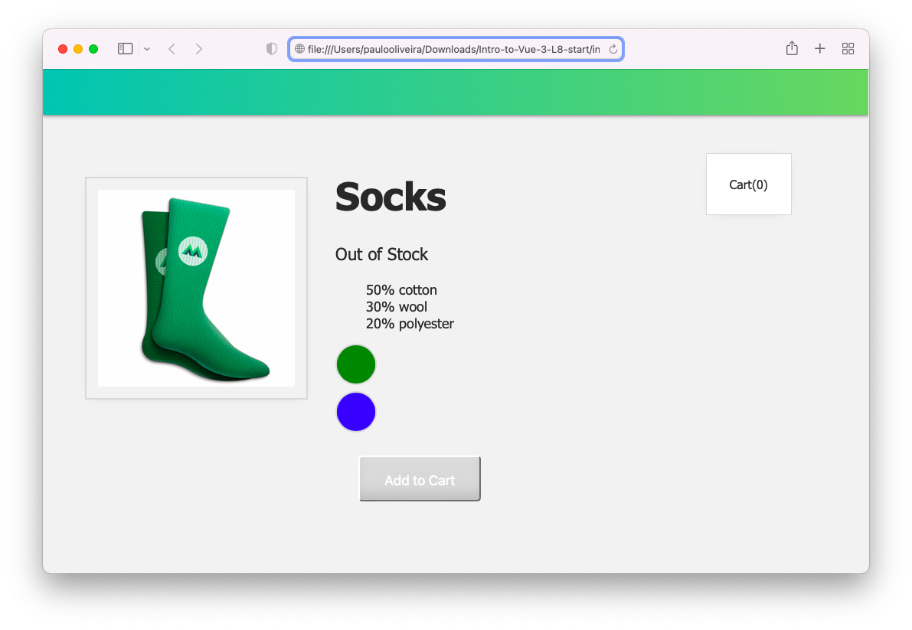
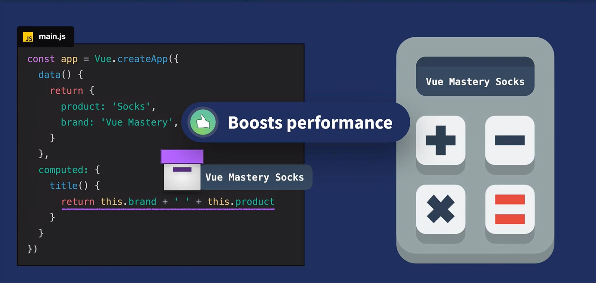
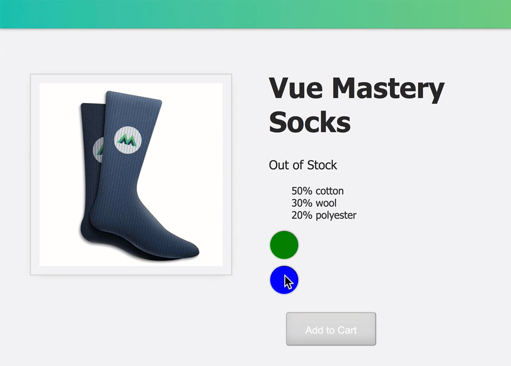
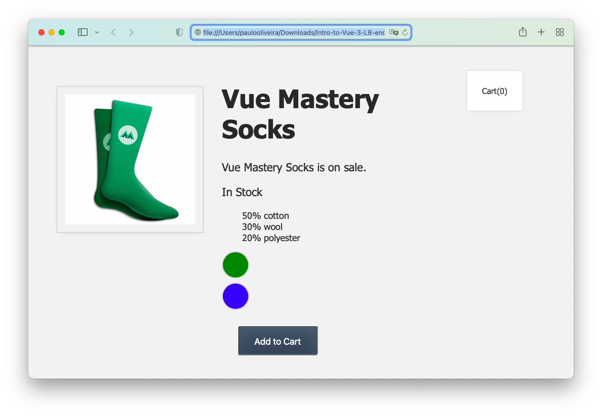

# **Introdução ao Vue.JS 3**

## **Este repositório possui um curso rápido de introdução ao Vue.JS 3**

Neste curso vamos aprender os fundamentos do Vue.JS e construir uma aplicação (_app_) para colocar estes conceitos em prática. Veja a figura abaixo.


## **IDE recomendado**

Vai-se utilizar o VSCode. Caso você ainda não o tenha [baixe-o](https://code.visualstudio.com/download), e depois instale-o.

Instale, também uma extensão do VSCode chamada [es6-string.html](https://marketplace.visualstudio.com/items?itemName=Tobermory.es6-string-html)

No final de cada tutorial, haverá um "***Coding Challenge***" para colocar os conceitos em prática.

## **Tutorial 8. Propriedades Calculadas (Computed Properties)**

### **Passo 1. Configurando o ambiente de desenvolvimento**

1.1 Crie uma pasta chamada "intro-to-vue-3"

>Ignore o passo acima caso já tenha feito o **Tutorial 2** (Criando um Vue _app_ ).

1.2 Caso queira, para iniciar, faça o download do código inicial no "branch" do [repositório.](https://github.com/csp1po/intro_vue_3/tree/t8-start). Depois extraia este arquivo e copie o seu conteúdo para dentro da pasta criada no passo 1.1.

1.3 No painel esquerdo do VS Code, você verá uma estrutura de diretório que se parece com a figura abaixo.


Dentro do arquivo "**index.html**", o seu conteúdo será:

```html
<!DOCTYPE html>
<html lang="en">
  <head>
    <meta charset="UTF-8" />
    <title>Vue Mastery</title>
    <!-- Import Styles -->
    <link rel="stylesheet" href="./assets/styles.css" />
    <!-- Import Vue.js -->
    <script src="https://unpkg.com/vue@3/dist/vue.global.js"></script>
  </head>
  <body>
    <div id="app">
      <div class="nav-bar"></div>

      <div class="cart">Cart({{ cart }})</div>
      
      <div class="product-display">
        <div class="product-container">
          <div class="product-image">
            
          </div>
          <div class="product-info">
            <h1>{{ product }}</h1>
            <p v-if="inStock">In Stock</p>
            <p v-else>Out of Stock</p>
            <ul>
              <li v-for="detail in details">{{ detail }}</li>
            </ul>

            <div 
              class="color-circle" 
              v-for="variant in variants" 
              :key="variant.id" 
              @mouseover="updateImage(variant.image)" 
              :style="{ backgroundColor: variant.color }"></div>
            <button class="button" :class="{ disabledButton: !inStock }" :disabled="!inStock" v-on:click="addToCart">Add to Cart</button>
          </div>
        </div>
      </div>
    </div>

    <!-- Import App -->
    <script src="./main.js"></script>

    <!-- Mount App -->
    <script>
      const mountedApp = app.mount('#app')
    </script>
  </body>
</html>
```

> Observe que neste tutorial estaremos importando a biblioteca do Vue.JS via um link CDN (_Content Delivery Network_). Este tipo de importação se usa somente para fins de prototipagem e aprendizado. Futuramente usaremos a instalação via uma interface de linha de comando (Vue CLI).
>

>Observe também que estamos importando um arquivo chamado "**main.js**". O seu conteúdo, por enquanto, é:

```javascript
const app = Vue.createApp({
    data() {
        return {
            cart:0,
            product: 'Socks',
            brand: 'Vue Mastery',
            image: './assets/images/socks_blue.jpg',
            inStock: false,
            details: ['50% cotton', '30% wool', '20% polyester'],
            variants: [
              { id: 2234, color: 'green', image: './assets/images/socks_green.jpg' },
              { id: 2235, color: 'blue', image: './assets/images/socks_blue.jpg' },
            ]
        }
    },
    methods: {
        addToCart() {
            this.cart += 1
        },
        updateImage(variantImage) {
            this.image = variantImage
        }
    }
})
```

>Neste tutorial, veremos o conceito de propriedades calculadas.(_Computed Properties_).
>
>>Ao abrir o arquivo "**index.html**" no browser, você verá a figura abaixo.



>Neste Tutorial vamos atualizar a imagem variante ("**variant image**") e verificar se ela está em estoque ou não, usando as propriedades calculadas (ou computadas). E é o que faremos no próximo passo.


### **Passo 2. Uma Simples Propriedade Calculada**

2.1 Abra o arquivo "**index.html**" e procure o pelo trecho de código abaixo:

```html
<h1>{{ product }}</h1>
```

Altere o código acima para:

```html
<h1>{{ brand + ' ' + product }}</h1>
```

Observe também que no arquivo "**main.js**" existe um trecho de código onde temos uma nova propriedade dos dados:

```javascript
data() {
   return {
      product: 'Socks',
      brand: 'Vue Mastery'
   }   
}
```

O que fizemos foi combinar a propriedade ``brand`` com ``product`` em nosso template (**Passo 2.1**).


2.2 Abra o arquivo "**index.html**" no browser, e você verá a imagem abaixo:


Ao verificarmos isso no navegador, veremos “**Vue Mastery Socks**” exibido. Mas não seria legal se, em vez de lidar com essa lógica no HTML interno, nosso aplicativo pudesse calcular esse valor para nós? Por exemplo, pegar a marca e o produto, somar e retornar esse novo valor.

As propriedades calculadas são exatamente isto. Podemos adicioná-las a um aplicativo Vue que calcula os valores para nós. Eles nos ajudam a manter a lógica computacional fora do modelo e nos fornecem melhorias de desempenho que serão abordadas futuramente. Por enquanto, vamos transformar este exemplo simples em uma propriedade computada. Vamos alterar a expressão do elemento ``<h1>``.

2.3 Para isto, abra o arquivo "**index.html**" no browser. Agora observe a linha abaixo:

```html
<h1>{{ brand + ' ' + product }}</h1>
```
E altere o código para:

```html
<h1>{{ title }}
```
> Agora, ``title`` é o nome de uma propriedade computada que criaremos agora. Primeiro, adicionaremos a opção computada ao aplicativo, logo abaixo de nossos métodos, e então criaremos a propriedade ``title``.


2.4 Abra o arquivo "**main.js**" e adicione o trecho de código abaixo:

```javascript
...
computed: {
   title() {
    return this.brand + ' ' + this.product
   }
}
```

2.5 Abra novamente o arquivo "**index.html**" no browser. Ao verificarmos o navegador, ainda veremos "**Vue Mastery Socks**" sendo exibida, exceto que agora abstraímos a lógica computacional do modelo e a incluímos perfeitamente no objeto de opções.


### **Passo 3. Compreendendo as Propriedades Calculadas**

Vamos dar uma olhada mais profunda em como isto está funcionando. Pense nelas como se fossem uma calculadora, que computa (i.e. calcula) valores para nós. Tal calculadora pega nossos valores (``brand``e ``product``), adiciona-os e nos dá o resultado. Observe a figura abaixo. 



> Como foi mencionado anteriormente, as propriedades computadas nos fornecem uma melhoria de desempenho. Isso ocorre porque elas armazenam em cache o valor calculado. O valor ("**Vue Mastery Socks**") é armazenado e atualizado apenas quando necessário, quando uma de suas dependências muda. Por exemplo, se a marca mudasse de '**Vue Mastery**' para '**Node Mastery**', nossa propriedade computada receberia essa nova dependência da marca (``brand``), então recalcularia e retornaria o novo valor: '**Node Mastery Socks**'.

Agora que estamos começando a entender as propriedades computadas, vamos implementar um exemplo mais prático em nossa Vue _app_.


### **Passo 4. Calculando (Computando) a Imagem e a Quantidade**

Voltando ao nosso código, vamos adicionar uma nova propriedade de quantidade aos nossos objetos variantes.

4.1 Abra o arquivo "**main.js**", e altere as linhas que tratam das variantes para:

```javascript
variants: [
    { id: 2234, color: 'green', image: './assets/images/socks_green.jpg', quantity: 50 },
    { id: 2235, color: 'blue', image: './assets/images/socks_blue.jpg', quantity: 0 },
]
```

>Observe agora como as meias verdes (_green socks_) têm uma quantidade de 50 enquanto as meias azuis (_blue socks_) têm 0. Em outras palavras, as verdes estão em estoque e as azuis estão esgotadas. No entanto, atualmente exibimos “**In Stock**” ou “**Out of Stock**” com base no valor de dados em estoque, que não reflete mais a verdade sobre nosso produto e suas quantidades variantes. Portanto, teremos que criar uma propriedade calculada que possamos usar para exibir ou a primeira ou a segunda mensagem acima, com base nessas novas quantidades.

Você lembra como atualizamos a imagem da variante, com base em qual cor está passando o mouse? Em vez do evento ``mouseover`` acionar o método ``updateImage()``, ele agora acionará um novo método chamado ``updateVariant()``.

4.2 Abra o arquivo "**index.html**" e observe o trecho de código abaixo:

```html
<div 
   class="color-circle" 
   v-for="variant in variants" 
   :key="variant.id" 
   @mouseover="updateImage(variant.image)" 
   :style="{ backgroundColor: variant.color }">
</div>
```

Altere-o para:

```html
<div 
  v-for="(variant, index) in variants" 
  :key="variant.id" 
  @mouseover="updateVariant(index)" <!-- novo método -->
  class="color-circle" 
  :style="{ backgroundColor: variant.color }">
</div>
```

Observe como estamos passando o índice (``index``) da variante atualmente em foco (``hover``): ``updateVariant(index)``. Obtivemos acesso a esse índice adicionando-o como um segundo parâmetro em nossa diretiva ``v-for``:

``v-for="(variant, index) in variants"``

Por que estamos passando ``index``? Vamos usá-lo para informar ao nosso aplicativo qual variante está passando o mouse no momento, para que ele possa usar essa informação para acionar a atualização da imagem **E** se essa variante está em estoque ou não.

4.3 Agora abra o arquivo "**main.js**" e adicione uma nova propriedade de dados ao nosso aplicativo, que será atualizada para igualar esse índice:

```javascript
data() {
  return {
    ...
    selectedVariant: 0,
    ...
  }
}
```


4.4 Ainda dentro do arquivo do Passo anterior (**4.3**), que é o "**main.js**" e adicione o trecho de código abaixo.

```javascript
methods: {
    ...
    updateVariant(index) {
        this.selectedVariant = index
    }
},
```

> Nosso método ``updateVariant()`` definirá o valor de ``selectedVariant`` igual ao índice da variante em que você está passando o mouse (i.e. _hovering_).

Agora que implementamos uma maneira de nosso aplicativo saber com qual variante de produto está sendo envolvido, podemos usar essas informações para acionar a "computação" de qual imagem mostrar e se mostrar a mensagem "**In Stock**" ou "**Out of Stock**”, com base em qual variante o usuário está passando o mouse.


4.5 Agora estamos prontos para excluir ``image`` e ``inStock`` de nossos dados e substituí-los por propriedades computadas com os mesmos nomes. Para isto, abra o arquivo "**main.js**", e adicione o código abaixo na propriedade ``computed``.

```javascript
computed: {
...
   image() {
      return this.variants[this.selectedVariant].image
   },
   inStock() {
      return this.variants[this.selectedVariant].quantity
   }
```

> O que fizemos? Estamos direcionando o primeiro ou o segundo elemento de nossa _array_ de variantes com base em ``selectedVariant``, que é 0 ou 1, dependendo de qual círculo da cor variante o mouse está passando. Em seguida, usamos apenas a notação de ponto para capturar a imagem dessa variante.

4.6 Ao verificar isso no browser, quando passamos o mouse sobre os círculos de cores, não apenas atualizamos a imagem da variante, mas também exibimos se essa variante está em estoque ou fora de estoque, usando sua quantidade. A figura abaixo mostra isto.




4.7 Observe na figura acima como o botão ainda está atualizando automaticamente para nós, ativando e desativando. Isso porque, em nosso modelo, ainda estamos usando ``inStock``. Portanto, temos que atualizar o arquivo "**index.html**". Abra-o e atualize o elemento ``<button>`` com o conteúdo abaixo.

```html
<button 
   class="button" 
   :class="{ disabledButton: !inStock }" 
   :disabled="!inStock" 
   v-on:click="addToCart">Add to Cart</button>
```

> Agora ``inStock`` não é mais uma propriedade de dados. Ela é a nova propriedade calculada.


### **Passo 5. Coding Challenge**

5.1 Adicione um valor booleano ``onSale`` aos dados.

5.2 Use uma propriedade computada para exibir a string: _‘brand + ’ ’ + product + ’ ’ is on sale’_, sempre que ``onSale`` for verdadeiro.

5.3 Abra o arquivo "**index.html**" no browser. Você verá algo assim.




