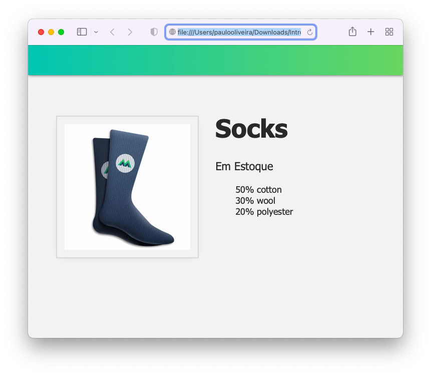
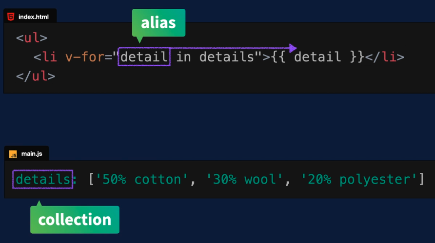
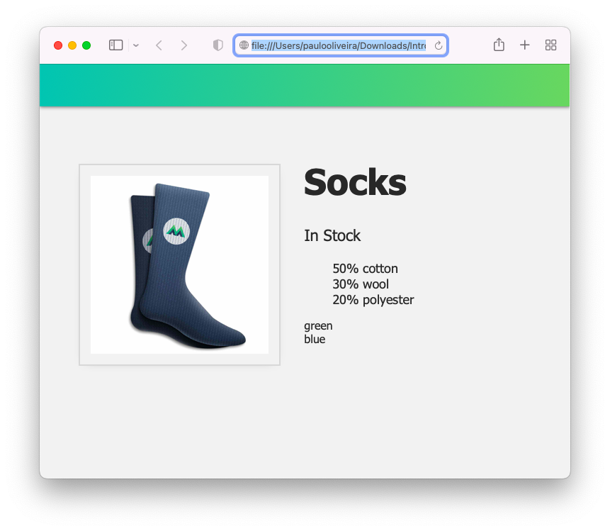
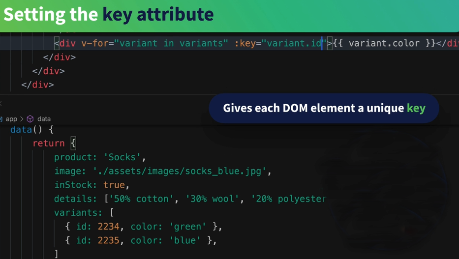
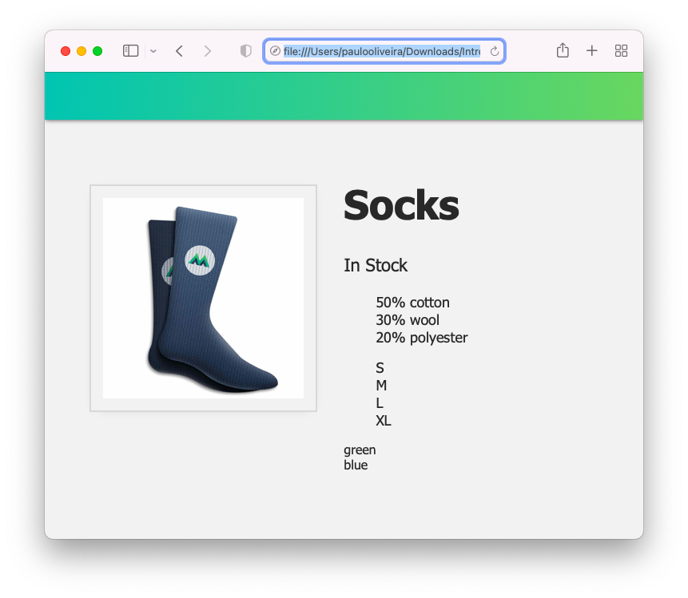

# **1. Tutorial Introdução ao Vue.JS 3**

## **Este repositório possui um curso rápido de introdução ao Vue.JS 3**

Neste curso vamos aprender os fundamentos do Vue.JS e construir uma aplicação (_app_) para colocar estes conceitos em prática. Veja a figura abaixo.


## **IDE recomendado**

Vai-se utilizar o VSCode. Caso você ainda não o tenha [baixe-o](https://code.visualstudio.com/download), e depois instale-o.

Instale, também uma extensão do VSCode chamada [es6-string.html](https://marketplace.visualstudio.com/items?itemName=Tobermory.es6-string-html)

No final de cada tutorial, haverá um "Coding Challenge" para colocar os conceitos em prática.

## **5. Renderização de Lista**

### **Passo 1. Configurando o ambiente de desenvolvimento**

1.1 Crie uma pasta chamada "intro-to-vue-3"

>Ignore o passo acima caso já tenha feito o **Tutorial 2** (Criando um Vue _app_ ).

1.2 Caso queira, para iniciar, faça o download do código inicial no "branch" do [repositório.](https://github.com/csp1po/intro_vue_3/tree/t5-start). Depois extraia este arquivo e copie o seu conteúdo para dentro da pasta criada no passo 1.1.

1.3 No painel esquerdo do VS Code, você verá uma estrutura de diretório que se parece com a figura abaixo.


Dentro do arquivo "**index.html**", o seu conteúdo será:

```html
<!DOCTYPE html>
<html lang="en">
  <head>
    <meta charset="UTF-8" />
    <title>Vue Mastery</title>
    <!-- Import Styles -->
    <link rel="stylesheet" href="./assets/styles.css" />
    <!-- Import Vue.js -->
    <script src="https://unpkg.com/vue@3/dist/vue.global.js"></script>
  </head>
  <body>
    <div id="app">
      <div class="nav-bar"></div>
      <div class="product-display">
        <div class="product-container">
          <div class="product-image">
            
          </div>
          <div class="product-info">
            <h1>{{ product }}</h1>
            <p v-if="inStock">Em Estoque</p>
            <p v-else>Fora de Estoque</p>
          </div>
        </div>
      </div>
    </div>

    <!-- Import App -->
    <script src="./main.js"></script>

    <!-- Mount App -->
    <script>
      const mountedApp = app.mount('#app')
    </script>
  </body>
</html>
```

> Observe que neste tutorial estaremos importando a biblioteca do Vue.JS via um link CDN (_content delivery network_). Este tipo de importação se usa somente para fins de prototipagem e aprendizado. Futuramente usaremos a instalação via uma interface de linha de comando (Vue CLI).
>
>Observe também que estamos importando um arquivo chamado "**main.js**". O seu conteúdo, por enquanto, é muito simples:

```javascript
const app = Vue.createApp({
    data() {
        return {
            product: 'Socks',
            image: './assets/images/socks_blue.jpg',
            inStock: true,
            details: ['50% cotton', '30% wool', '20% polyester']
        }
    }
})
```

>No final deste tutorial, queremos renderizar listas HTML de uma _array_ em nossos dados. Em outras palavras, como vamos mostrar ``details``como uma lista?


### **Passo 2. Efetuando um "*looping*" em _arrays_ de dados**

2.1 Abra o arquivo "**index.html**" e procure o pelo trecho de código abaixo:

```html
<div class="product-info">
    <h1>{{ product }}</h1>
    <p v-if="inStock">Em Estoque</p>
    <p v-else>Fora de Estoque</p>
</div>
```

2.2 Agora vamos adicionar uma lista não ordenada (``<ul>``) no código acima (**Passo 2.1**). Para isto, abra o arquivo "**index.html**", e substitua o trecho de código pelo que está abaixo:

```html
<div class="product-info">
    <h1>{{ product }}</h1>
    <p v-if="inStock">Em Estoquek</p>
    <p v-else>Fora de Estoque</p>
    <ul>
       <li v-for="detail in details">{{ detail }}</li>
    </ul>
```

>Usamos uma diretiva do Vue chamada ``v-for``. Dentro da expressão do ``v-for``, escrevemos: ``detail in details``. Aqui, ``details`` refere-se ao array ``details`` em nossos dados, e ``detail`` é o _alias_ (apelido) para o elemento atual desse array, já que estamos iterando por ele para imprimir um novo elemento ``<li>``.

>Cada ``<li>`` exibirá esse elemento do _array_ porque no HTML interno escrevemos uma expressão: ``{{ detail }}`` para imprimir cada detalhe.  

2.3 Agora abra o arquivo "**index.html**" no browser. Veremos uma lista de detalhes. Ver a figura abaixo.



Surge, então uma pergunta. Mas como a diretiva ``v-for`` está realmente funcionando? A figura abaixo mostra o funcionamento desta diretiva.



O _alias_ ``detail`` efetua um "_looping_" sobre a coleção de dados (_array_) que está no arquivo "**main.js**", e, a cada iteração, um elemento da lista (i.e. _array_) é mostrado na página HTML.


### **Passo 3. Cores Variantes do Produto**

Para nos familiarizarmos com a renderização de lista usando ``v-for``, trabalharemos em outro exemplo em nosso _app_. Vamos adicionar uma _array_ de variantes aos nossos dados:

3.1  Abra o arquivo "**main.js**", e troque seu conteúdo pelo código abaixo.

```javascript
const app = Vue.createApp({
    data() {
        return {
            product: 'Socks',
            image: './assets/images/socks_blue.jpg',
            inStock: true,
            details: ['50% cotton', '30% wool', '20% polyester'],
            variants: [
              { id: 2234, color: 'green' },
              { id: 2235, color: 'blue' },
            ]
        }
    }
})
```

>Agora temos um _array_ que contém um objeto para cada variante do nosso produto. Estas variantes possuem um ``id`` e uma ``color``. Portanto, para nossa próxima tarefa, vamos imprimir cada cor variante e usaremos o id para ajudar o Vue a acompanhar os itens de nossa lista.

3.2 No arquivo "**index.html**", adicione o código abaixo logo após o elemento ``<ul>``.

```html
<div v-for="variant in variants">{{ variant.color }}</div>
```

3.3 Agora abra o arquivo "**index.html**" no browser. Você verá a página abaixo.



>Observe que estamos usando a notação de ponto (_dot notation_) para imprimir cada variante à medida que percorremos a _array_ chamada de ``variants``.


### **Passo 4. Atributo de chave (key attribute): essencial para itens de lista**

4.1 Vamos alterar a linha de código do **Passo 3.3**. Abra o arquivo "**index.html**", e altere a linha para:

```html
<div v-for="variant in variants" :key="variant.id">{{ variant.color }}</div>
```
>Surge, então a pergunta: Mas o que esse atributo ``:key`` está fazendo aí?

>Ao dizer ``:key="variant.id"``, estamos usando a abreviação do ``v-bind`` para vincular o ``id`` da variante ao atributo ``key``. Isso dá a cada elemento DOM uma chave exclusiva para que o Vue possa compreender o elemento e não perdê-lo conforme as coisas são atualizadas no _app_.

>Isso fornece algumas melhorias de desempenho e, posteriormente, se você estiver fazendo algo como animar seus elementos, descobrirá que o atributo ``key`` realmente ajuda o Vue a gerenciá-los efetivamente à medida que eles se movem pelo DOM.

Observe a figura abaixo. Ela ilustra o que acabamos de fazer no Passo 4.1 acima. Ao definir um atributo ``key``, provê a cada elemento DOM uma chave (``key``) única.




### **Passo 6. Coding Challenge**

6.1 Adicione uma _array_ de tamanhos (``sizes``) (**S**, **M**, **L**, **XL**) ao objeto de dados.


6.2 Use ``v-for`` para mostrar os ``sizes`` em uma lista.


6.3 Abra o arquivo "**index.html**" no browser. Você verá algo assim.




