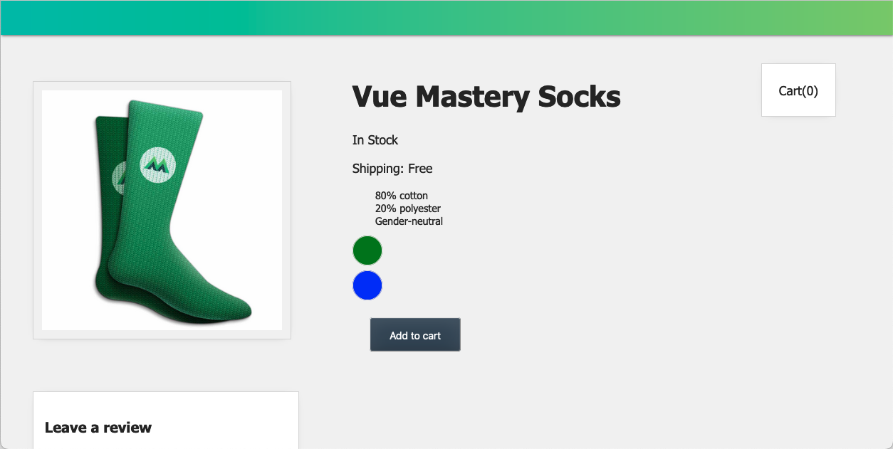
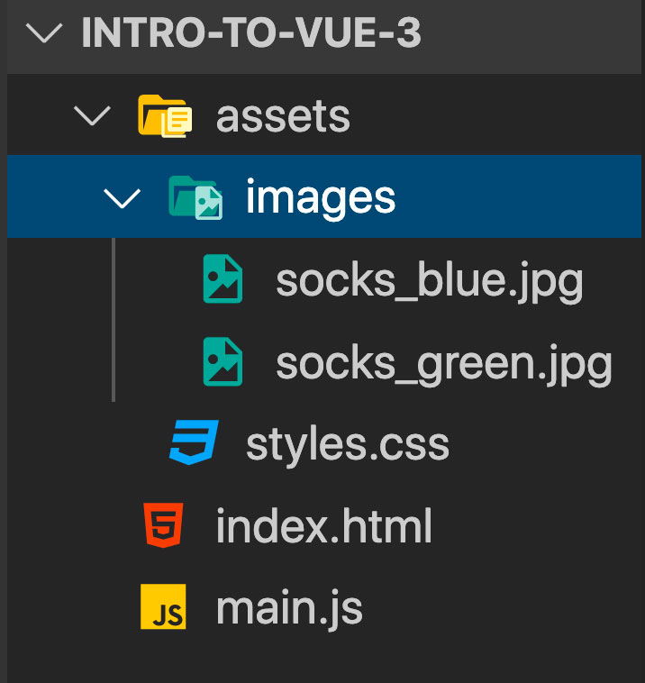
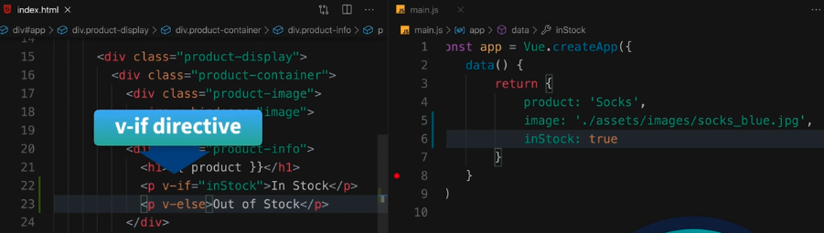
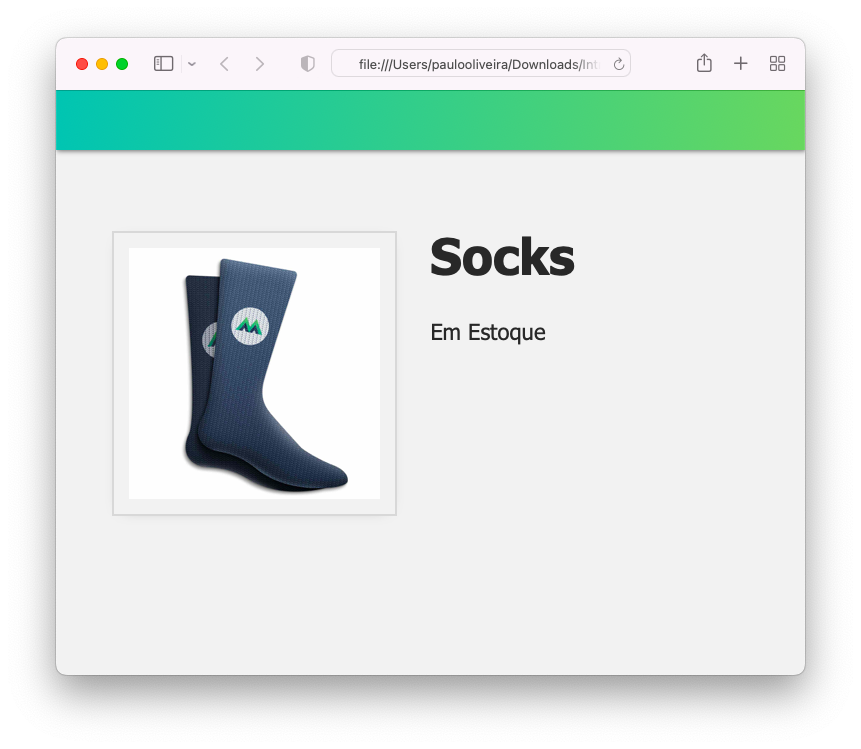
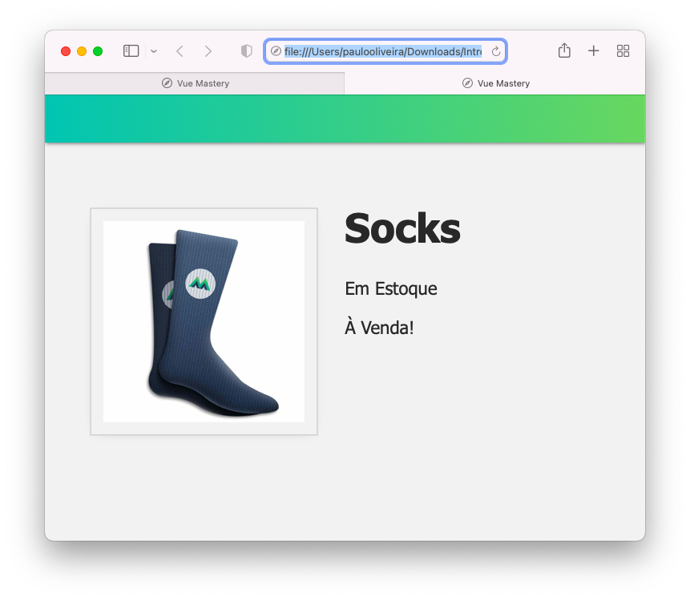

# **1. Tutorial Introdução ao Vue.JS 3**

## **Este repositório possui um curso rápido de introdução ao Vue.JS 3**

Neste curso vamos aprender os fundamentos do Vue.JS e construir uma aplicação (_app_) para colocar estes conceitos em prática. Veja a figura abaixo.



## **IDE recomendado**

Vai-se utilizar o VSCode. Caso você ainda não o tenha [baixe-o](https://code.visualstudio.com/download), e depois instale-o.

Instale, também uma extensão do VSCode chamada [es6-string.html](https://marketplace.visualstudio.com/items?itemName=Tobermory.es6-string-html)

No final de cada tutorial, haverá um "Coding Challenge" para colocar os conceitos em prática.

## **4. Renderização Condicional**

### **Passo 1. Configurando o ambiente de desenvolvimento**

1.1 Crie uma pasta chamada "intro-to-vue-3"

>Ignore o passo acima caso já tenha feito o **Tutorial 2** (Criando um Vue _app_ ).

1.2 Caso queira, para iniciar, faça o download do código inicial no "branch" do [repositório.](https://github.com/csp1po/intro_vue_3/tree/t4-start). Depois extraia este arquivo e copie o seu conteúdo para dentro da pasta criada no passo 1.1.

1.3 No painel esquerdo do VS Code, você verá uma estrutura de diretório que se parece com a figura abaixo.



Dentro do arquivo "**index.html**", o seu conteúdo será:

```html
<!DOCTYPE html>
<html lang="en">
  <head>
    <meta charset="UTF-8" />
    <title>Vue Mastery</title>
    <!-- Import Styles -->
    <link rel="stylesheet" href="./assets/styles.css" />
    <!-- Import Vue.js -->
    <script src="https://unpkg.com/vue@3/dist/vue.global.js"></script>
  </head>
  <body>
    <div id="app">
      <div class="nav-bar"></div>
      <div class="product-display">
        <div class="product-container">
          <div class="product-image">
            
          </div>
          <div class="product-info">
            <h1>{{ product }}</h1>
          </div>
        </div>
      </div>
    </div>

    <!-- Import App -->
    <script src="./main.js"></script>

    <!-- Mount App -->
    <script>
      const mountedApp = app.mount('#app')
    </script>
  </body>
</html>
```

> Observe que neste tutorial estaremos importando a biblioteca do Vue.JS via um link CDN (_content delivery network_). Este tipo de importação se usa somente para fins de prototipagem e aprendizado. Futuramente usaremos a instalação via uma interface de linha de comando (Vue CLI).
>
>Observe também que estamos importando um arquivo chamado "**main.js**". O seu conteúdo, por enquanto, é muito simples:

```javascript
const app = Vue.createApp({
    data() {
        return {
            product: 'Socks',
            image: './assets/images/socks_blue.jpg'
        }
    }
})
```

>No final deste tutorial, queremos exibir diferentes elementos HTML com base em uma condição. Exibiremos um elemento ``<p>`` que diz "**em estoque**" quando nosso produto está em estoque ou outro elemento ``<p>`` que diz "**fora de estoque**" quando não está.

### **Passo 2. Renderizar ou Não Renderizar**

2.1 Abra o arquivo "**index.html**" e procure o pelo trecho de código abaixo:

```html
<div class="product-info">
    <h1>{{ product }}</h1>
</div>
```

2.2 Agora vamos adicionar dois elementos ``<p>``. Para isto, abra o arquivo "**index.html**", e substitua o trecho de código do passo 2.1 pelo que está abaixo:

```html
<div class="product-info">
   <h1>{{ product }}</h1>
   <p>Em Estoque</p>
   <p>Fora de Estoque</p>
</div>
```
>Queremos que apenas um deles apareça dependendo se nosso produto está em estoque ou não. Então vamos para o objeto de dados do nosso _app_ Vue e adicionamos um valor booleano ``inStock``.

2.3 Abra o arquivo "**main.js**" e troque o seu conteúdo por este:

```javascript
const app = Vue.createApp({
    data() {
        return {
            product: 'Socks',
            image: './assets/images/socks_blue.jpg',
            inStock: true   //new data property
        }
    }
})
```

>Agora que adicionamos os elementos que queremos renderizar condicionalmente e a condição (``inStock``) que usaremos para decidir qual renderizar, estamos prontos para aprender sobre outra diretiva Vue.


### **Passo 3. A Diretira v-if**

3.1 Podemos adicionar a diretiva ``v-if`` em um elemento para renderizá-lo com base em uma condição, da seguinte maneira. No arquivo "**index.html**", na linha onde temos ``<p>Em Estoque</p>``, troque-a por ``<p v-if="inStock">Em Estoque</p>``.

>Agora, este elemento será renderizado somente se ``inStock`` for verdadeiro. Podemos combinar a diretiva ``v-if`` com sua diretiva irmã ``v-else`` para exibir outro elemento como substituto se a primeira condição for falsa. 

3.2 No arquivo "**index.html**", na linha onde temos ``<p>Fora de Estoque</p>``, troque-a por ``<p v-else>Fora de Estoque</p>``.

>Veja a figura abaixo.

>

Agora, se ``inStock`` possui valor ``false``, iremos ver a mensagem "**Fora de Estoque**" renderizado na página.

###Vamos testar as duas condições

3.3 Agora abra o arquivo "**index.html**" no browser. Você verá a página abaixo.



3.4 Abra o arquivo "**main.js**" e altere o valor da propriedade ``inStock`` para ``false``. Após isto, abra o arquivo "**index.html**" no browser. Você verá a figura abaixo.


### **Passo 4. Mostrar e Ocultar (Show and Hide)**

Vale a pena notar que você nem sempre precisa emparelhar ``v-if`` com ``v-else``. Existem muitos casos de uso em que não há necessidade de um elemento alternativo para renderizar. No entanto, nesses casos, às vezes é uma opção melhor usar a diretiva ``v-show``. 

Poderíamos codificar assim:

``<p v-show="inStock">Em Estoque</p>``

>A diretiva ``v-show`` é usada para alternar a **visibilidade** de um elemento em vez de adicionar e remover totalmente o elemento do DOM, como ``v-if`` faz.

Esta é uma opção de melhor desempenho se você tiver algo que está aparecendo ou desaparecendo na tela com frequência. Podemos verificar isso definindo a propriedade ``inStock`` como ``false`` e exibindo o elemento nas ferramentas do desenvolvedor do navegador. Quando ``v-show`` é usado, podemos ver que o elemento ainda está presente no DOM, mas agora está oculto com um estilo de exibição embutido: nenhum; adicionado a ele. Ver abaixo.

```html
<p style="display: none;">Em Estoque</p>
```

### **Passo 5. Lógica Condicional Encadeada**

No **Passo 3**, vimos ``v-if`` com ``v-else``. Agora vamos dar uma olhada em como podemos adicionar camadas adicionais de lógica condicional.

5.1 Abra o arquivo "**main.js**" e altere a linha ``inStock: false`` para ``inventory: 100``. O arquivo ficará assim:


```javascript
const app = Vue.createApp({
    data() {
        return {
            ...
            inventory: 100
    }
```

5.2 Como nossa condição (``inventory``) agora é um número inteiro, podemos usar uma lógica um pouco mais complexa em nossa expressão. Para isto, abra o arquivo "**index.html**", e altere o conteúdo do elemento ``<p>`` para o código abaixo:

```html
<p v-if="inventory > 10">Em Estoque</p>
<p v-else>Fora de Estoque<p>
```

>Agora, só renderizaremos a primeira tag ``<p>`` se o inventário for maior que 10.
>Se abrirmos o arquivo "**index.html**" no browser teremos a figura abaixo.
>


5.3 Digamos que agora queremos exibir uma nova mensagem quando o produto estiver quase esgotado. Nesta situação, poderíamos adicionar outro nível condicional, onde estamos atentos para que a propriedade ``inventory`` fique abaixo de 10 mas acima de 0 (altere o valor da propriedade ``inventory`` em "**main.js**" para **8**). Agora abra o arquivo "**index.html**" altere as linhas dos elementos ``<p>`` em questão, para:

```html
<p v-if="inventory > 10">Em Estoque</p>
<p v-else-if="inventory <= 10 && inventory > 0">Quase esgotado!</p>
<p v-else>Fora de Estoque</p>
```
5.4 Ao abrir o arquivo "index.html" no browser, irá aparecer a figura abaixo.


>A diretiva ``v-else-if`` nos dá uma camada intermediária de lógica. Como podemos observer, quando o valor da propriedade ``inventory`` foi alterado para 8, o elemento em questão foi renderizado. 
>
>Claro que, se o valor de ``inventory``for zero, vamos padronizar para o nível final de ``v-else`` e exibir “**Fora de estoque**”. Veja a figura abaixo.


### **Passo 6. Coding Challenge**

6.1 Adicione uma propridade booleana ``onSale`` ao objeto de dados.


6.2 Use ``onSale`` para renderizar condicionalmente um elemento ``<p>`` que diz "**À Venda**", sempre que ``onSale`` for verdadeiro.


6.3 Abra o arquivo "**index.html**" no browser. Você verá algo assim.




