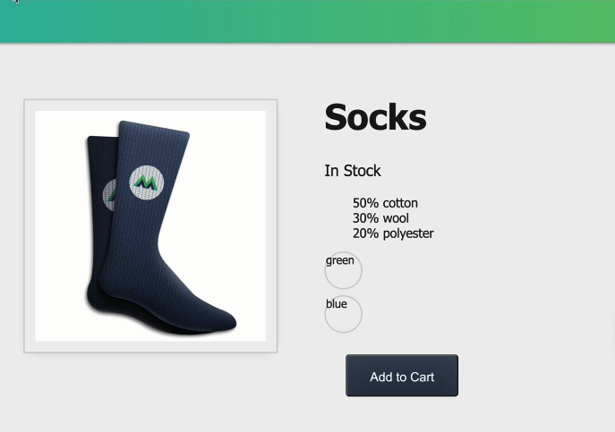
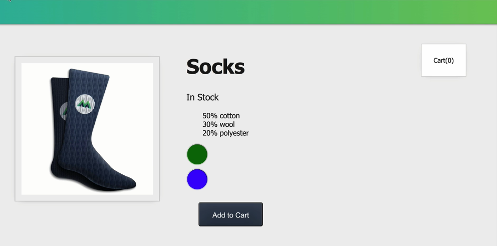
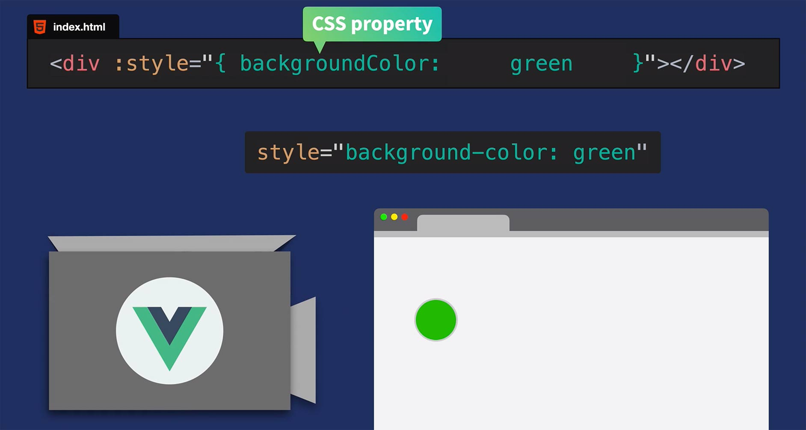
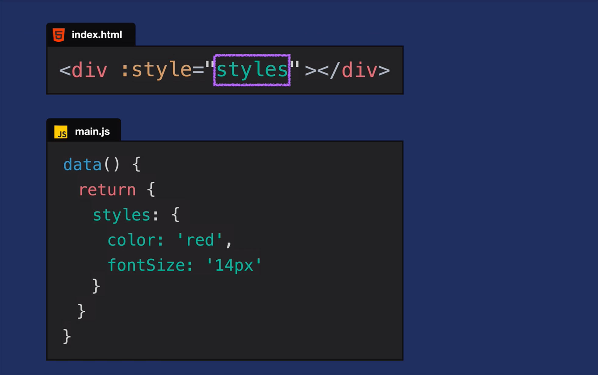
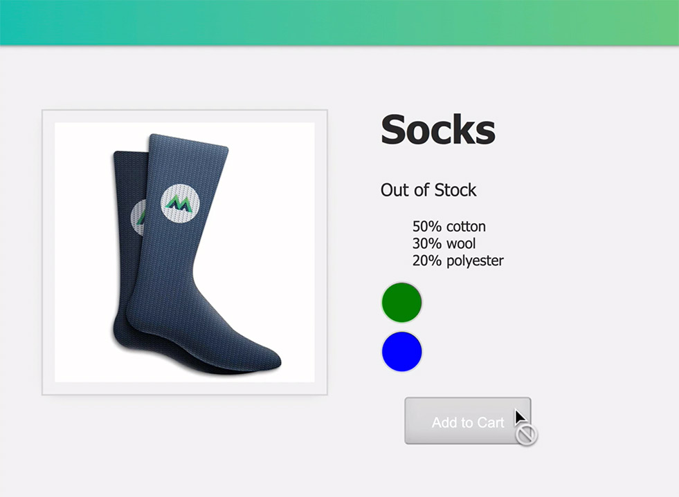
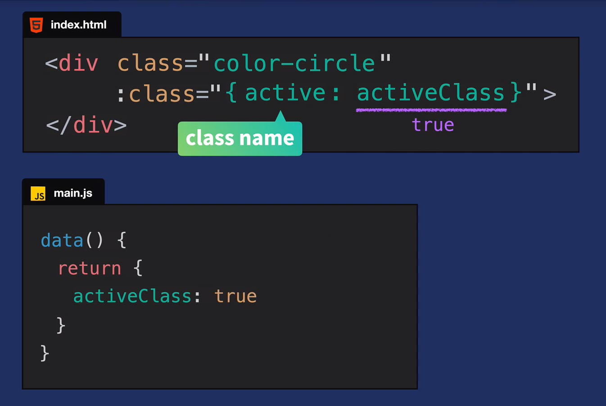
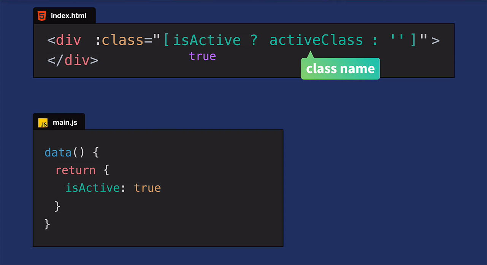
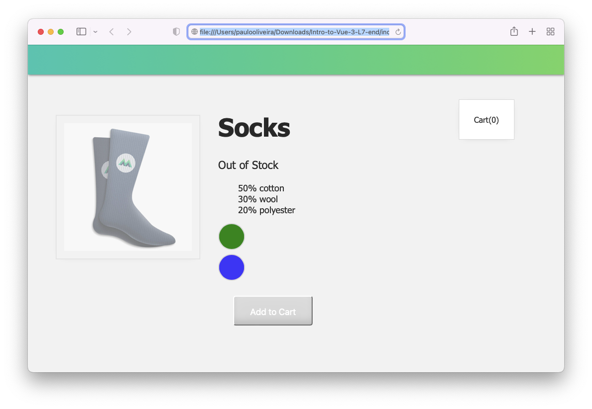

# **Introdução ao Vue.JS 3**

## **Este repositório possui um curso rápido de introdução ao Vue.JS 3**

Neste curso vamos aprender os fundamentos do Vue.JS e construir uma aplicação (_app_) para colocar estes conceitos em prática. Veja a figura abaixo.


## **IDE recomendado**

Vai-se utilizar o VSCode. Caso você ainda não o tenha [baixe-o](https://code.visualstudio.com/download), e depois instale-o.

Instale, também uma extensão do VSCode chamada [es6-string.html](https://marketplace.visualstudio.com/items?itemName=Tobermory.es6-string-html)

No final de cada tutorial, haverá um "***Coding Challenge***" para colocar os conceitos em prática.

## **Tutorial 7. Vinculação de Classe e Estilo (Class & Style Binding)**

### **Passo 1. Configurando o ambiente de desenvolvimento**

1.1 Crie uma pasta chamada "intro-to-vue-3"

>Ignore o passo acima caso já tenha feito o **Tutorial 2** (Criando um Vue _app_ ).

1.2 Caso queira, para iniciar, faça o download do código inicial no "branch" do [repositório.](https://github.com/csp1po/intro_vue_3/tree/t7-start). Depois extraia este arquivo e copie o seu conteúdo para dentro da pasta criada no passo 1.1.

1.3 No painel esquerdo do VS Code, você verá uma estrutura de diretório que se parece com a figura abaixo.


Dentro do arquivo "**index.html**", o seu conteúdo será:

```html
<!DOCTYPE html>
<html lang="en">
  <head>
    <meta charset="UTF-8" />
    <title>Vue Mastery</title>
    <!-- Import Styles -->
    <link rel="stylesheet" href="./assets/styles.css" />
    <!-- Import Vue.js -->
    <script src="https://unpkg.com/vue@3/dist/vue.global.js"></script>
  </head>
  <body>
    <div id="app">
      <div class="nav-bar"></div>

      <div class="cart">Cart({{ cart }})</div>
      
      <div class="product-display">
        <div class="product-container">
          <div class="product-image">
            
          </div>
          <div class="product-info">
            <h1>{{ product }}</h1>
            <p v-if="inStock">In Stock</p>
            <p v-else>Out of Stock</p>
            <ul>
              <li v-for="detail in details">{{ detail }}</li>
            </ul>

            <div 
              v-for="variant in variants" 
              :key="variant.id" 
              @mouseover="updateImage(variant.image)" 
            >{{ variant.color }}</div>
            <button class="button" @click="addToCart">Add to Cart</button>
          </div>
        </div>
      </div>
    </div>

    <!-- Import App -->
    <script src="./main.js"></script>

    <!-- Mount App -->
    <script>
      const mountedApp = app.mount('#app')
    </script>
  </body>
</html>

```

> Observe que neste tutorial estaremos importando a biblioteca do Vue.JS via um link CDN (_Content Delivery Network_). Este tipo de importação se usa somente para fins de prototipagem e aprendizado. Futuramente usaremos a instalação via uma interface de linha de comando (Vue CLI).
>

Observe também que estamos importando um arquivo chamado "**main.js**". O seu conteúdo, por enquanto, é:

```javascript
const app = Vue.createApp({
    data() {
        return {
            cart:0,
            product: 'Socks',
            brand: 'Vue Mastery',
            image: './assets/images/socks_blue.jpg',
            inStock: false,
            details: ['50% cotton', '30% wool', '20% polyester'],
            variants: [
              { id: 2234, color: 'green', image: './assets/images/socks_green.jpg' },
              { id: 2235, color: 'blue', image: './assets/images/socks_blue.jpg' },
            ]
        }
    },
    methods: {
        addToCart() {
            this.cart += 1
        },
        updateImage(variantImage) {
            this.image = variantImage
        }
    }
})

```

>Neste tutorial, veremos o conceito de vinculação de classe e estilo.(_Class and Style Binding_).
>
>>Ao abrir o arquivo "**index.html**" no browser, você verá a figura abaixo.


>No Tutorial 06, adicionamos um recurso onde, ao passar o mouse sobre as palavras ``green`` ou ``blue``, a imagem que está sendo exibida será atualizada; ou seja, meias verdes ou azuis, respectivamente. Mas a experiência do usuário (UX) não seria melhor se, em vez de passar o mouse sobre as palavras "verde" ou "azul", passássemos o mouse sobre as cores reais **verde** ou **azul**? É o que faremos no próximo passo.


### **Passo 2. Vinculando o Estilo**

A grande pergunta aqui é: **como podemos mostrar as próprias cores variantes (``variant colors``)**? 

2.1 Abra o arquivo "**index.html**" e procure o pelo trecho de código abaixo:

```html
<div 
   v-for="variant in variants" 
   :key="variant.id" 
   @mouseover="updateImage(variant.image)">
    {{ variant.color }}
</div>
```

Altere o código acima para:

```html
<div 
  v-for="variant in variants" 
  :key="variant.id" 
  @mouseover="updateImage(variant.image)" 
  class="color-circle">
  {{ variant.color }} 
</div>
```

>Observe que esta classe já está definida no nosso arquivo ``styles.css``. Veja abaixo.

```css
.color-circle {
  width: 50px;
  height: 50px;
  margin-top: 8px;
  border: 2px solid #d8d8d8;
  border-radius: 50%;
}
```

>Como você pode ver, ele simplesmente transforma nossa ``<div>`` em um círculo com 50px de diâmetro. Veja a figura abaixo.


 

Assim como parece, queremos vincular estilos à "**div**" das variantes. Faremos isso usando ``v-bind`` (ou sua abreviação: ``:``) no atributo ``style`` e vinculando um objeto a ele. Também precisamos definir o ``backgroundColor`` dessa ``<div>`` para que seja igual ao ``variant.color``. Então, em vez de imprimir essas strings (i.e. “*green*” e “*blue*”), estamos usando-as para definir a cor de fundo de nossos círculos. 

2.2 Para isto, abra o arquivo "**index.html**" e procure o pelo trecho de código abaixo:

```html
<div 
  v-for="variant in variants" 
  :key="variant.id" 
  @mouseover="updateImage(variant.image)" 
  class="color-circle">
  {{ variant.color }} 
</div>
```

Agora altere o código para:

```html
<div 
  v-for="variant in variants" 
  :key="variant.id" 
  @mouseover="updateImage(variant.image)" 
  class="color-circle" 
  :style="{ backgroundColor: variant.color }">
</div>
```

2.3 Abra o arquivo "**index.html**" no browser. Você verá algo assim.




### **Passo 3. Compreendendo a Vinculação de Estilos (Style Binding)**

Vamos dar uma olhada mais profunda em como isto está funcionando. Observe a figura abaixo.



Na nossa ``<div>`` variante, adicionamos o atributo ``<style>`` e vinculamos um objeto de estilo a ele. Veja o código:

```html
<div 
  ...
  :style="{ backgroundColor: variant.color }">
</div>
```

Esse objeto de estilo tem a propriedade CSS ``backgroundColor``, e a estamos definindo igual a qualquer que seja a cor variante no momento da iteração ``v-for``. Na primeira iteração, ``variant.color`` é ``green``. O VueJS pega essas informações e as converte no código: ``style="{ backgroundColor: green }"``. E então imprime um círculo de fundo verde. Este processo é repetido para a segunda ``variant.color`` (i.e. ``blue``) para criar o círculo azul.


#### Observação #1: usando os modos "Camel Case" ou "Kebab Case"

Antes de prosseguir, convém fazer uma explanação sobre estes conceitos. De acordo com o Chat-GPT:

_Camel Case e Kebab Case são duas convenções de nomeação de identificadores em programação_.

_No modo Camel case, as palavras são unidas sem espaços e a primeira letra de cada palavra, exceto a primeira, é capitalizada. Por exemplo, "camelCase", "meuNomeDeVariável", "dataDeNascimento"_.

_No modo Kebab case, também conhecido como dash case, as palavras são unidas com hífens e todas as letras são minúsculas. Por exemplo, "kebab-case", "meu-nome-de-variável", "data-de-nascimento"_. 

_Ambas as convenções são comumente usadas em programação para nomear variáveis, funções e outros identificadores. A escolha entre elas geralmente é uma questão de preferência pessoal ou de convenção adotada pela comunidade de programadores._

Há algumas coisas importantes a considerar ao usar vinculação de estilo. Observe o trecho de código abaixo.

``<div :style="{ backgroundColor: variant.color }"></div>``

Na expressão acima, lembre-se que este objeto de estilo é todo JavaScript. É por isso que foi usado o modo ``camelCase`` no nome da propriedade (i.e. ``backgroundColor``). Se tivéssemos colocado ``background-color``, isso teria sido interpretado como um sinal de menos (subtração). Mas não estamos fazendo nenhuma operação matemática aqui. Estamos definindo um nome de uma propriedade CSS!!.

Então, como estamos definindo um objeto JavaScript, temos que usar o modo ``camelCase``. Caso queiramos usar o modo ``kebab-case``, temos que colocar o nome da propridade entre aspas para evitar a má interpretação matemática, assim:

``<div :style="{ 'background-color': variant.color }"></div>``

Ambas opções funcionarão, desde que você se lembre de colocar as aspas.


#### Observação #2: Alternativa para Vinculação de Estilo: usando Objetos"

Às vezes, você pode querer adicionar vários estilos a um elemento, mas adicioná-los todos em linha ("*inline*") pode ser confuso. Nessas situações, podemos vincular a um objeto de estilo inteiro que reside em nossos dados (``main.js``). Veja a figura abaixo.



Agora que examinamos o tópico de vinculação de estilo, vamos examinar um tópico semelhante: vinculação de classe.


### **Passo 4. Vinculação de Classe (Class Binding)**

Voltando ao nosso aplicativo, você notará que quando nosso valor de dados ``inStock`` for falso, ainda podemos clicar no botão ``Add to Cart`` e incrementar o valor do carrinho. Mas se o produto estiver esgotado, talvez não queiramos que o usuário consiga adicionar o produto. Então, vamos mudar esse comportamento, desabilitando o botão. E sempre que ``inStock`` for ``false`` e fazendo o botão parecer desabilitado, usando "class binding".

4.1 Para começar, usaremos a abreviação de ``v-bind`` no atributo ``disabled`` para adicioná-lo sempre que nosso produto não estiver em estoque. Abra o arquivo "**index.html**", e altere as linhas do elemento ``<button>`` para:

```html
<button 
  class="button" 
  :disabled="!inStock" 
  @click="addToCart">
  Add to Cart
</button>
```

>Agora, sempre que ``inStock`` for ``false`` e clicarmos no botão ``Add to Cart``, nada acontecerá, pois ele está desativado. Porém, o botão ainda parece ativo, e isto é enganoso para o usuário. Então, vamos usar "class binding" para adicionar uma classe chamada ``disabledButton`` também, sempre que ``inStock`` for ``false``.


4.2 Você verá em nosso arquivo CSS que já temos essa classe chamada ``disabledButton``, que define a ``background-color`` para cinza (_gray_) e torna o cursor não permitido para uso. Agora abra o arquivo "**styles.css**" e altere (caso não esteja) o trecho de código onde está a ``disabledButton`` para:

```html
.disabledButton {
  background-color: #d8d8d8;
  cursor: not-allowed;
}
```

Para aplicar esta classe condicionalmente, com base no valor de ``inStock``, usaremos a abreviação de ``v-bind`` no atributo ``class``, e usaremos uma expressão que adiciona (ou não) a classe ``disabledButton``  sempre que ``!inStock``.

4.3 Agora abra o arquivo "**index.html**" e altere o trecho de código do elemento ``<button>`` para:

```html
<button 
  class="button" 
  :class="{ disabledButton: !inStock }" 
  :disabled="!inStock" 
  @click="addToCart">
  Add to Cart
</button>
```

>A partir de agora, sempre que ``inStock`` for ``false``, o botão não só será desabilitado, como também aparecerá desabilitado.
>


4.4 Abra o arquivo "**index.html**" no browser. Você verá algo assim.



### **Passo 5. Múltiplos Nomes de Classes**

Ao começar a vinculação de classe, há algumas coisas a serem observadas. Por exemplo, o que acontece quando já temos uma classe existente e queremos adicionar condicionalmente outra com base em um valor de dados dentro de uma mesma ``<div>``?

Por exemplo, se já tivermos uma classe chamada ``color-circle`` em uma ``<div>`` e adicionarmos uma classe chamada ``active`` condicionalmente, como isso ficará? A figura abaixo mostra o que pretendemos fazer.



Essas classes serão combinadas da seguinte forma: 

```html
<div class="color-circle active"></div>
```

### **Passo 6. Operadores Ternários**

Uma ferramenta útil que a vinculação de classe nos oferece é a capacidade de usar operadores ternários em linha para adicionar classes diferentes com base em uma condição. Observe a figura abaixo.



Nesse caso, como ``isActive`` é ``true``, estamos de fato adicionando a classe chamada ``activeClass``. Caso seja ``false``, não adicionaríamos nenhuma classe (``''``). Alternativamente, poderíamos ter adicionado uma classe totalmente diferente.

As variações na sintaxe e os casos de uso que acabamos de praticar com vinculação de estilo e classe, são apenas o começo. Portanto, recomenda-se verificar a documentação do Vue para mais casos de uso e exemplos.

### **Passo 7. Coding Challenge**

7.1 Vincule a classe ``out-of-stock-img`` à sua imagem correspondente sempre que ``inStock`` for ``false``.


7.2 Abra o arquivo "**index.html**" no browser. Você verá algo assim.




