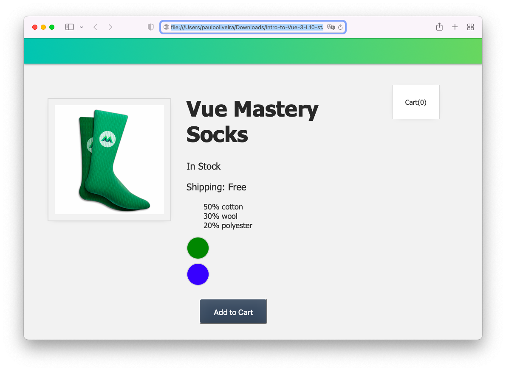
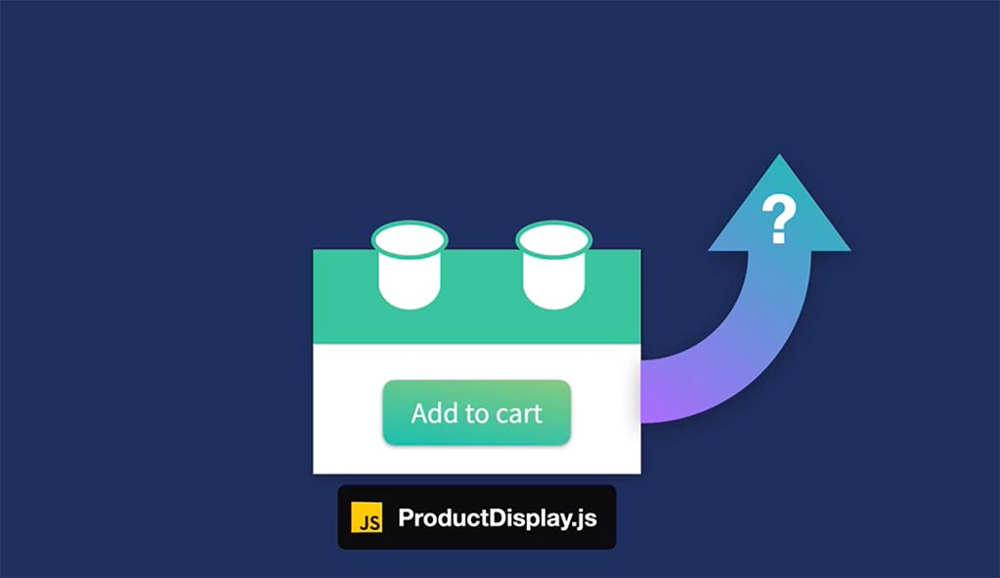
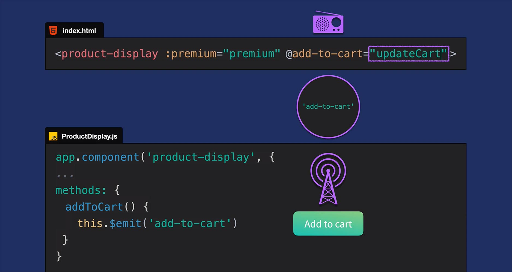
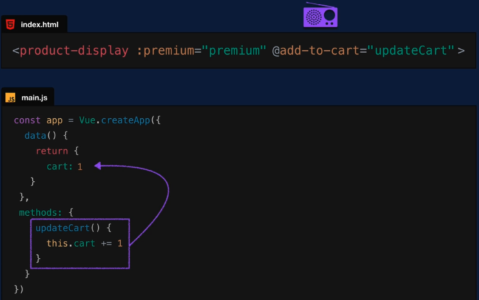
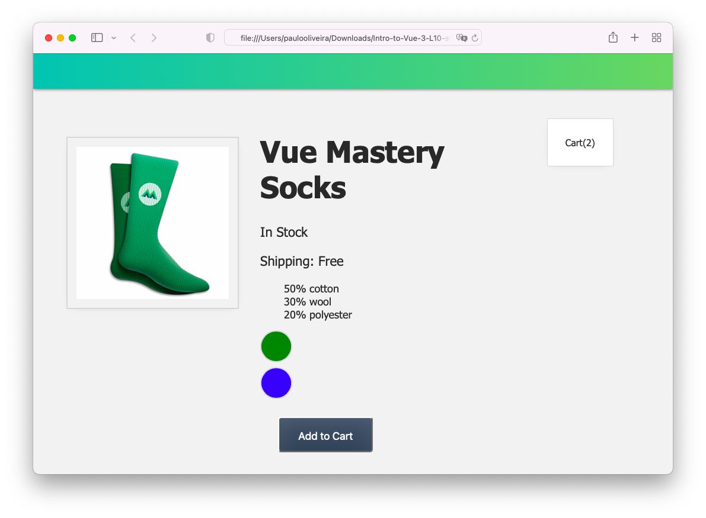
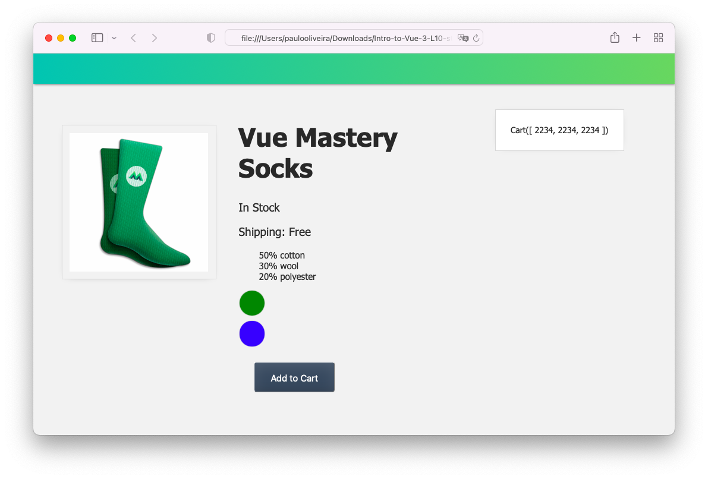
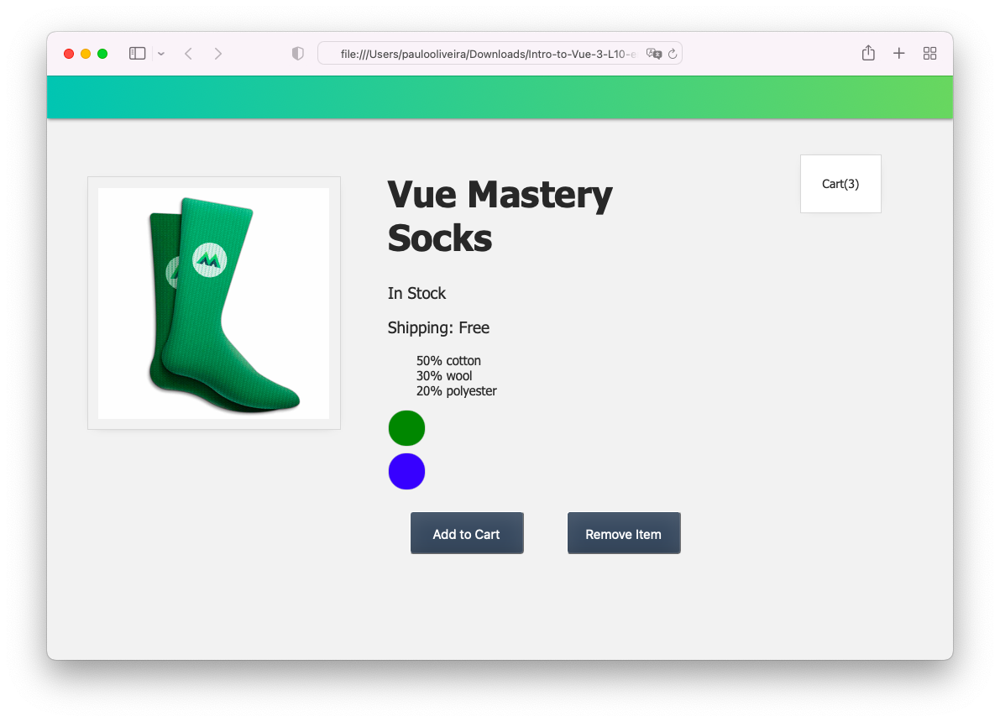

# **Introdução ao Vue.JS 3**

## **Este repositório possui um curso rápido de introdução ao Vue.JS 3**

Neste curso vamos aprender os fundamentos do Vue.JS e construir uma aplicação (_app_) para colocar estes conceitos em prática. Veja a figura abaixo.


## **IDE recomendado**

Vai-se utilizar o VSCode. Caso você ainda não o tenha [baixe-o](https://code.visualstudio.com/download), e depois instale-o.

Instale, também uma extensão do VSCode chamada [es6-string.html](https://marketplace.visualstudio.com/items?itemName=Tobermory.es6-string-html)

No final de cada tutorial, haverá um "***Coding Challenge***" para colocar os conceitos em prática.

## **Tutorial 10. Comunicação de Eventos**

### **Passo 1. Configurando o ambiente de desenvolvimento**

1.1 Crie uma pasta chamada "intro-to-vue-3"

>Ignore o passo acima caso já tenha feito o **Tutorial 2** (Criando um Vue _app_ ).

1.2 Caso queira, para iniciar, faça o download do código inicial no "branch" do [repositório.](https://github.com/csp1po/intro_vue_3/tree/t10-start). Depois extraia este arquivo e copie o seu conteúdo para dentro da pasta criada no passo 1.1.

1.3 No painel esquerdo do VS Code, você verá uma estrutura de diretório que se parece com a figura abaixo.


Dentro do arquivo "**index.html**", o seu conteúdo será:

```html
<!DOCTYPE html>
<html lang="en">
  <head>
    <meta charset="UTF-8" />
    <title>Vue Mastery</title>
    <!-- Import Styles -->
    <link rel="stylesheet" href="./assets/styles.css" />
    <!-- Import Vue.js -->
    <script src="https://unpkg.com/vue@3/dist/vue.global.js"></script>
  </head>
  <body>
    <div id="app">
      <div class="nav-bar"></div>

      <div class="cart">Cart({{ cart }})</div>
      <product-display :premium="premium"></product-display>
    </div>

    <!-- Import App -->
    <script src="./main.js"></script>

    <!-- Import Components -->
    <script src="./components/ProductDisplay.js"></script>

    <!-- Mount App -->
    <script>
      const mountedApp = app.mount('#app')
    </script>
  </body>
</html>
```

> Observe que neste tutorial estaremos importando a biblioteca do Vue.JS via um link CDN (_Content Delivery Network_). Este tipo de importação se usa somente para fins de prototipagem e aprendizado. Futuramente usaremos a instalação via uma interface de linha de comando (Vue CLI).
>

>Observe também que estamos importando um arquivo chamado "**main.js**". O seu conteúdo, por enquanto, é:

```javascript
const app = Vue.createApp({
    data() {
        return {
            cart: 0,
            premium: true
        }
    },
    methods: {}
})
```

>Neste tutorial, veremos o conceito de comunicação de eventos que acontecem em nossos componentes.
>
>Ao abrir o arquivo "**index.html**" no browser, você verá a figura abaixo.



>O objetivo aqui é dar ao nosso componente a capacidade de permitir que seu componente "_pai_" saiba que um evento aconteceu dentro dele.

### **Passo 2. Emitindo Um Evento**

Quando refatoramos as coisas no tutorial anterior (**Tutorial 9**), nós movemos o código relacionado ao produto para o novo componente chamado ``product-display``, e, com isto, quebramos a capacidade de clicar no botão ``Add to Cart`` e incrementar o valor do carrinho. Isso aconteceu porque o carrinho fica fora do componente ``product-display``, dentro do aplicativo Vue raiz no arquivo "**main.js**".
Nós precisamos dar ao componente ``product-display`` uma maneira de "_anunciar_" que seu botão foi clicado. Como fazemos isso acontecer?

Já sabemos que as ``props`` são uma maneira de passar dados para um componente, mas e quando algo acontece dentro desse componente, como por exemplo, um clique de botão? Como permitimos que outras partes do nosso aplicativo saibam que esse evento aconteceu? Ver figura abaixo.



A resposta é *emitir* esse evento, informando ao componente _pai_ que isso aconteceu. Vamos adicionar essa capacidade em nosso componente ``product-display``, corrigindo o método ``addToCart()``.


2.1 Abra o arquivo "**components/ProductDisplay.js**" e procure o pelo trecho de código abaixo:

```javascript
methods: {
   addToCart() {
      this.cart += 1
   },
   ...
```

Agora altere o código acima para:

```javascript
methods: {
  addToCart() {
    this.$emit('add-to-cart')
  }
  ...
 }
```
O que fizemos foi escrever ``this.$emit()`` e emitir um evento chamado ``add-to-cart``. Então, quando o botão é clicado, estamos emitindo ou "borbulhando" esse evento. Podemos ouvi-lo dentro do escopo do evento _pai_, onde estamos usando ``product-display``, adicionando um ouvinte (i.e. ``listener``): ``@add-to-cart``.


2.2 Agora abra o arquivo "**index.html**" e procure pelo trecho de código abaixo:

```html
<product-display :premium="premium"></product-display>
```
Altere o conteúdo acima por:

```html
<product-display :premium="premium" @add-to-cart="updateCart"></product-display>
```
O que acontece aqui é que quando esse evento for “ouvido” pelo componente _pai_, ele acionará um novo método com o nome de ``updateCart``. A figura abaixo ilustra o que está acontecendo.



Nesta figura abaixo vemos o método já implementado no arquivo "**main.js**". Faremos isto posteriormente. 




2.3 Abra o arquivo "**main.js**" e adicione o trecho de código abaixo:

```javascript
...
methods: {
    updateCart() {
        this.cart += 1
    },
```

2.4 Abra o arquivo "**index.html**" no browser. Você verá a figura abaixo e tudo está funcionando. Ao clicarmos no botão ``Add to Cart``, o valor do carrinho é alterado.



> Em outras palavras, ao clicarmos no botão ``Add to Cart``,  isto permitiu que o componente _pai_ soubesse que o evento de adição ao carrinho ocorreu, acionando o método ``updateCart()``.


### **Passo 3. Adicionando o ID do Produto ao Carrinho**

Para tornar nosso aplicativo (ou _app_) mais realista, nosso carrinho não deve ser apenas um número. Deve ser uma _array_ que contém os ``ids`` dos produtos que são adicionados a ele. Aí, então, vamos fazer um pouco de refatoração.

3.1 Abra o arquivo "**main.js**" e altere alguns trechos de código como está abaixo.

```javascript
const app = Vue.createApp({
  data() {
    return {
      cart: [],
      ...
    }
  },
  methods: {
    updateCart(id) {
      this.cart.push(id)
    }
  }
})
```
Observe que ``cart``agora é uma _array_ e o método ``updateCart(id)`` tem um parâmetro que recebe o ``ID`` do produto nele. 

3.2 Precisamos agora adicionar um parâmetro a mais na  emissão do evento ``add-to-cart``, para que ``updateCart`` tenha acesso a esse ``id``. Abra o arquivo "**components/ProductDisplay.js**" e altere-o com o trecho de código abaixo.

```javascript
methods: {
  addToCart() {
    this.$emit('add-to-cart', this.variants[this.selectedVariant].id)
  }
  ...
 }
```
O que fizemos aqui, foi adicionar um segundo parâmetro e pegamos o ``id` do produto da mesma forma que pegamos a imagem e a quantidade antes. Veja, por exemplo, o trecho abaixo.

```javascript
computed: {
  image() {
    return this.variants[this.selectedVariant].image
  },
  inStock() {
  return this.variants[this.selectedVariant].quantity
  }
}
```

3.3 Agora abra o arquivo "**index.html**" no browser. Você verá a figura abaixo.



> Porém não precisamos realmente exibir esses ``IDs`. Queremos apenas exibir quantos itens estão no carrinho. Felizmente, essa é uma solução rápida.

3.4 Abra o arquivo "**index.html**" e altere a ``<div>`` do carrinho para:

```html
<div id="app">
  ...
  <div class="cart">Cart({{ cart.length }})</div>
  ...
</div>
```
> Ao adicionar ``cart.length``, agora exibiremos apenas a quantidade de itens no carrinho.


### **Passo 4. Coding Challenge**

4.1 Adicione um novo botão para  ``product-display``, que remove o produto do carrinho.

4.2 Abra o arquivo "**index.html**" no browser. Você verá algo assim.




