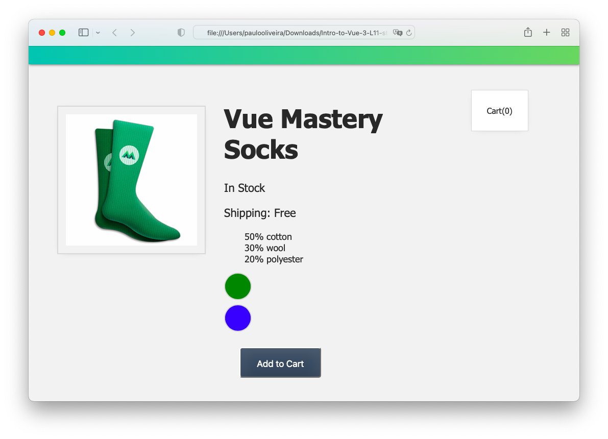
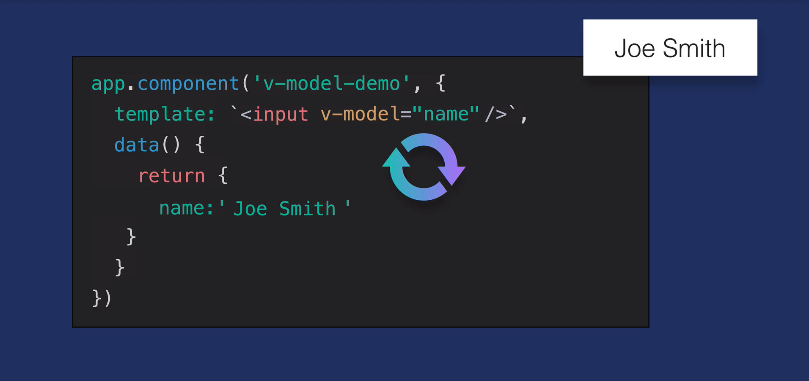
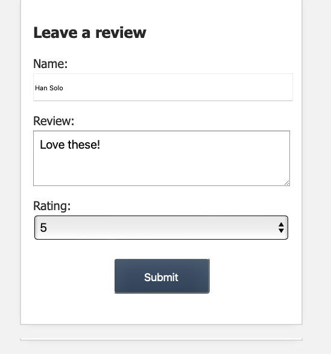
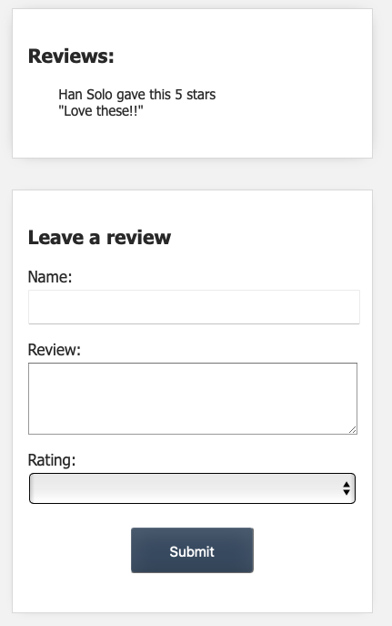
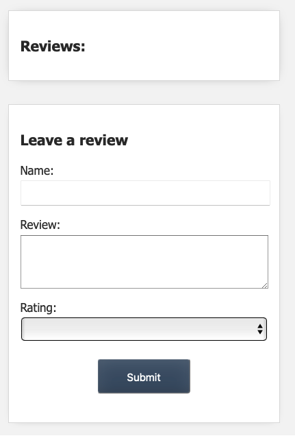
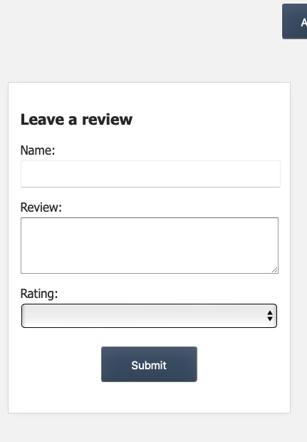
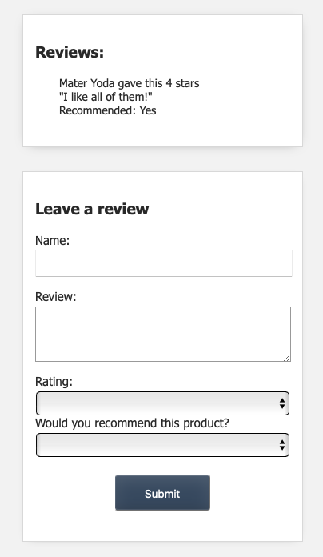

# **Introdução ao Vue.JS 3**

## **Este repositório possui um curso rápido de introdução ao Vue.JS 3**

Neste curso vamos aprender os fundamentos do Vue.JS e construir uma aplicação (_app_) para colocar estes conceitos em prática. Veja a figura abaixo.


## **IDE recomendado**

Vai-se utilizar o VSCode. Caso você ainda não o tenha [baixe-o](https://code.visualstudio.com/download), e depois instale-o.

Instale, também uma extensão do VSCode chamada [es6-string.html](https://marketplace.visualstudio.com/items?itemName=Tobermory.es6-string-html)

No final de cada tutorial, haverá um "***Coding Challenge***" para colocar os conceitos em prática.

## **Tutorial 11. Formulários (Forms) e "v-model"**

### **Passo 1. Configurando o ambiente de desenvolvimento**

1.1 Crie uma pasta chamada "intro-to-vue-3"

>Ignore o passo acima caso já tenha feito o **Tutorial 2** (Criando um Vue _app_ ).

1.2 Caso queira, para iniciar, faça o download do código inicial no "branch" do [repositório.](https://github.com/csp1po/intro_vue_3/tree/t11-start). Depois extraia este arquivo e copie o seu conteúdo para dentro da pasta criada no passo 1.1.

1.3 No painel esquerdo do VS Code, você verá uma estrutura de diretório que se parece com a figura abaixo.


Dentro do arquivo "**index.html**", o seu conteúdo será:

```html
<!DOCTYPE html>
<html lang="en">
  <head>
    <meta charset="UTF-8" />
    <title>Vue Mastery</title>
    <!-- Import Styles -->
    <link rel="stylesheet" href="./assets/styles.css" />
    <!-- Import Vue.js -->
    <script src="https://unpkg.com/vue@3/dist/vue.global.js"></script>
  </head>
  <body>
    <div id="app">
      <div class="nav-bar"></div>

      <div class="cart">Cart({{ cart.length }})</div>
      <product-display :premium="premium" @add-to-cart="updateCart"></product-display>
    </div>

    <!-- Import App -->
    <script src="./main.js"></script>

    <!-- Import Components -->
    <script src="./components/ProductDisplay.js"></script>

    <!-- Mount App -->
    <script>
      const mountedApp = app.mount('#app')
    </script>
  </body>
</html>
```

> Observe que neste tutorial estaremos importando a biblioteca do Vue.JS via um link CDN (_Content Delivery Network_). Este tipo de importação se usa somente para fins de prototipagem e aprendizado. Futuramente usaremos a instalação via uma interface de linha de comando (Vue CLI).
>

>Observe também que estamos importando um arquivo chamado "**main.js**". O seu conteúdo, por enquanto, é:

```javascript
const app = Vue.createApp({
    data() {
        return {
            cart: [],
            premium: true
        }
    },
    methods: {
        updateCart(id) {
            this.cart.push(id)
        }
    }
  })
```

>Neste tutorial, veremos o conceito vinculação com formulários.
>
>Ao abrir o arquivo "**index.html**" no browser, você verá a figura abaixo.



>O objetivo aqui é criar um formulário para os usuários adicionarem avaliações dos produtos.

### **Passo 2. Introduzindo o Conceito de v-model**

Num dos primeiros tutoriais, aprendemos sobre a diretiva de vinculação chamada de  ``v-bind``. Ela cria uma ligação unidirecional, dos dados para o template. Ao trabalhar com formulários, no entanto, essa ligação unidirecional não é suficiente. Precisamos também vincular o template aos dados.

Por exemplo, quando um usuário insere seu nome em um campo de entrada (elemento ``<input>``), queremos registrar e armazenar esse valor em nossos dados. A diretiva ``v-model`` nos ajuda a conseguir isso, criando uma vinculação de dados bidirecional ("**two-way data binding**"). Veja a figura abaixo.



Para ver tudo isso em ação, vamos criar um novo componente chamado ``review-form``.

2.1 Crie um arquivo chamado "**components/ReviewForm.js**" na pasta "**components**" e adicione o trecho de código abaixo:

```javascript
app.component('review-form', {
  template:
  /*html*/
  `<form class="review-form">
    <h3>Leave a review</h3>
    <label for="name">Name:</label>
    <input id="name">

    <label for="review">Review:</label>      
    <textarea id="review"></textarea>

    <label for="rating">Rating:</label>
    <select id="rating">
      <option>5</option>
      <option>4</option>
      <option>3</option>
      <option>2</option>
      <option>1</option>
    </select>

    <input class="button" type="submit" value="Submit">
  </form>`,
  data() {
    return {
      name: '',
      review: '',
      rating: null
    }
  }
})
```

Dentro do nosso template, observe os seguintes elementos:

* ``<input id="name">``
* ``<textarea id="review">``
* ``<selecionar id="rating">``

> O que queremos, na verdade, é vincular esses campos de entrada às suas respectivas propriedades de dados para que, quando o usuário preencher o formulário, vamos armazená-los localmente. Observe também o método ``data()`` no arquivo acima. 
> 
> Para conseguirmos isso vamos adicionar a diretiva ``v-model`` a cada um desses elementos de entrada.

2.2 Ainda dentro do arquivo "**components/ReviewForm.js**", altere o seu conteúdo para:

```javascript
app.component('review-form', {
  template:
  /*html*/
  `<form class="review-form">
    <h3>Leave a review</h3>
    <label for="name">Name:</label>
    <input id="name" v-model="name">

    <label for="review">Review:</label>      
    <textarea id="review" v-model="review"></textarea>

    <label for="rating">Rating:</label>
    <select id="rating" v-model.number="rating">
      <option>5</option>
      <option>4</option>
      <option>3</option>
      <option>2</option>
      <option>1</option>
    </select>

    <input class="button" type="submit" value="Submit">  
  </form>`,
  data() {
    return {
      name: '',
      review: '',
      rating: null
  }
})
```


### **Passo 3. Submentendo o Formulário de Revisão (Review Form)**

Para enviar este formulário, adicionaremos um ``listener`` no início dele:

3.1 Abra o arquivo "**components/ReviewForm.js**" e altere a linha de definição do elemento ``<form>``.

```javascript
app.component('review-form', {
  template:
  /*html*/
  `<form class="review-form" @submit.prevent="onSubmit">
    ...
    <input class="button" type="submit" value="Submit">  
  </form>`
  ...
})
```

> Estamos usando um modificador chamado ``@submit.prevent="onSubmit"`` para evitar o comportamento padrão (i.e. uma atualização do browser). Quando este formulário for enviado, ele acionará o método ``onSubmit()``, que vamos fazer no próximo passo.


3.2 Abra o arquivo "**components/ReviewForm.js**" e adicione o trecho de código abaixo.

```javascript
...
data() {
  return {
    name: '',
    review: '',
    rating: null
   }
 },
 methods: {
   onSubmit() {
     let productReview = {
       name: this.name,
       review: this.review,
       rating: this.rating,
     }
     this.$emit('review-submitted', productReview)

     this.name = ''
     this.review = ''
     this.rating = null
   }
 }
...
```
Esse método (``onSubmit()``) criará um objeto chamado ``productReview``, contendo as propriedades ``name``, ``review`` e ``rating`` do método ``data()``. Em seguida, ele emitirá (``$emit``) um evento chamado ``review-submitted``, enviando esse ``produtoReview`` como um parâmetro.


### **Passo 4. Usando o Review Form**

4.1 Agora que nosso formulário de revisão foi criado, podemos importar nosso componente. Para isto, abra o arquivo "**index.html**" e insira a linha abaixo.

```html
<!-- Import Components -->
...
<script src="./components/ReviewForm.js"></script>
...
```
Em seguida, iremos para ``product-display`` e usaremos o componente dentro do seu template, abaixo da ``<div>`` ``product-container``.

4.2 Abra o arquivo "**components/ProductDisplay.js**" e adicione a linha abaixo:

```html
template: 
  /*html*/
  `<div class="product-display">
    <div class="product-container">
     ...
    </div>
    <review-form></review-form>
  </div>`
})
```

4.3 Abra o arquivo "**index.html**" no browser e veja que o componente ``review-form`` foi inserido.



> Parece que está funcionando... exceto que quando clicamos no botão ``Submit``, estamos emitindo o evento, mas não o ouvimos em nenhum lugar. Como aprendemos no tutorial anterior (**Tutorial 10**), precisamos ouvir o evento ``review-submitted`` no escopo do componente _pai_ (i.e. no ``product-display``).

Quando o evento for "ouvido", adicionaremos o parâmetro ``productReview`` aos dados do componente.

Em suma, precisamos fazer duas coisas:

a. Ouvir o evento ``review-submitted``

b. Adicionar uma "_review_" ao componente ``ProductDisplay``

4.4 Vamos adicionar o ``event listener`` no ``review-form``, onde está sendo usado. Abra o arquivo "**components/ProductDisplay.js**" e altere a linha onde está componente ``review-form``para:

```javascript
template: 
  /*html*/
  `<div class="product-display">
    <div class="product-container">
     ...
    </div>
    <review-form @review-submitted="addReview"></review-form>
  </div>`
})
```
Quando o evento acontecer, acionaremos um novo método chamado ``addReview()``. Isso adicionará avaliações de produtos ao nosso componente de exibição de produtos (``product-display``), o que significa que esse componente precisa de uma nova _array_ chamada ``reviews`` em seus dados.

4.5 Abra o arquivo "**components/ProductDisplay.js**" e adicione a linha abaixo.

```javascript
...
data() {
  return {
    ...
    reviews: []
  }
}
...
```
4.6 Ainda dentro do arquivo "**components/ProductDisplay.js**", vamos detalhar o método ``addReview()``:

```javascript
...
data() {
  return {
    ...
    reviews: []
   }
 },
methods: {
  ...
  addReview(review) {
    this.reviews.push(review)
  }
},
...
```  

> Como você pode ver, o método pega a ``review`` que recebemos como parâmetro do evento ``review-submitted`` e a coloca na _array_ de revisões (``reviews``).
  
### **Passo 5. Mostrando as Revisões (Reviews)**

Agora que implementamos a capacidade de adicionar revisões, precisamos exibi-las. Vamos criar um novo componente para fazer isso. Esse componente será chamado de ``review-list``.

5.1 Crie um arquivo chamado "**components/ReviewList.js**" na pasta "**components**" e adicione o código abaixo.

```javascript
app.component('review-list', {
  props: {
    reviews: {
      type: Array,
      required: true
    }
  },
  template:
  /*html*/
  `
  <div class="review-container">
  <h3>Reviews:</h3>
    <ul>
      <li v-for="(review, index) in reviews" :key="index">
        {{ review.name }} gave this {{ review.rating }} stars
        <br/>
        "{{ review.review }}"
        <br/>
      </li>
    </ul>
  </div>
`
})
```
> Observe que este arquivo terá uma ``prop`` para receber as reviews e imprimi-las no template usando a diretiva ``v-for``, incluindo o ``index``, para que possamos vincular o atributo ``:key`` a ele.

5.2 Agora vamos importar o componente para o arquivo "**index.html**". Para isto, abra-o e adicione o trecho de código abaixo.

```html
<!-- Import Components -->
...
<script src="./components/ReviewList.js"></script>
...
```

5.3 Em seguida, adicione-o dentro da ``<div>`` ``product-display``, logo acima do ``review-form``. Abra o arquivo "**components/ProductDisplay.js**" usando o código abaixo.

```javascript
template: 
  /*html*/
  `<div class="product-display">
    <div class="product-container">
     ...
    </div>
    <review-list :reviews="reviews"></review-list>
    <review-form @review submitted="addReview"></review-form>
  </div>`
})
```

Observe como adicionamos a ``prop`` chamada ``:reviews="reviews"`` para que possamos passar as ``reviews`` que estão em ``product-display`` para a lista chamada ``review-list``.

5.4 Agora abra o arquivo "**index.html**" no browser. Você verá que adicionamos uma nova _review_, clicamos no botão ``Submit`` e a veremos sendo exibida.



> Até aqui tudo bem, porém quando atualizamos o browser (e não há revisões), ainda vemos uma caixa vazia porque o componente da lista de revisões ainda está sendo renderizado sem revisões para imprimir. Ver figura abaixo.




> Vamos corrigir isso e apenas renderizar esse componente quando tivermos revisões para exibir.

5.5 Abra o arquivo "components/ProductDisplay.js" e adicione a linha com a diretiva ``v-if``.

```javascript
template: 
  /*html*/
  `<div class="product-display">
    ...
    <review-list v-if="reviews.length" :reviews="reviews"></review-list>
    ...
  </div>`
})
```
> Em outras palavras, se a _array_ ``reviews`` estiver vazia, não mostraremos o componente ``review-list``.
> Atualizando o browser, parece que está funcionando e o componente só aparece depois que adicionamos uma ``review``.



### **Passo 6. Validação de Formulário Básica**

Para terminar este tutorial, vamos adicionar algumas validações básicas ao nosso formulário de revisão (``review-form``).

6.1 Abra o arquivo "**components/ReviewForm.js**" e adicione o trecho de código abaixo.

```javascript
methods: {
  onSubmit() {
    if (this.name === '' || this.review === '' || this.rating === null) {
      alert('Review is incomplete. Please fill out every field.')
      return
    }
  ...
  }
}
```
> O que fizemos foi: antes de criarmos um ``productReview``, verificaremos se ``this.name`` ou ``this.review`` ou ``this.rating`` estão vazios. Caso aconteça, mostraremos um alerta, que diz: ‘_A revisão está incompleta. Por favor, preencha todos os campos_.'
E, em seguida, saia do método.

É claro que este é um método excessivamente simplificado de validação de formulário. Veremos este tópico futuramente com mais detalhes.


### **Passo 7. Coding Challenge**
  
7.1 Adicione uma pergunta ao formulário de avaliação ``review-form``: '**Would you recommend this product?**' (Você recomendaria este produto?).

7.2 Grave e emita a resposta e exiba-a na lista de revisão (``review-list``).

7.3 Abra o arquivo "**index.html**" no browser. Você verá algo assim.




