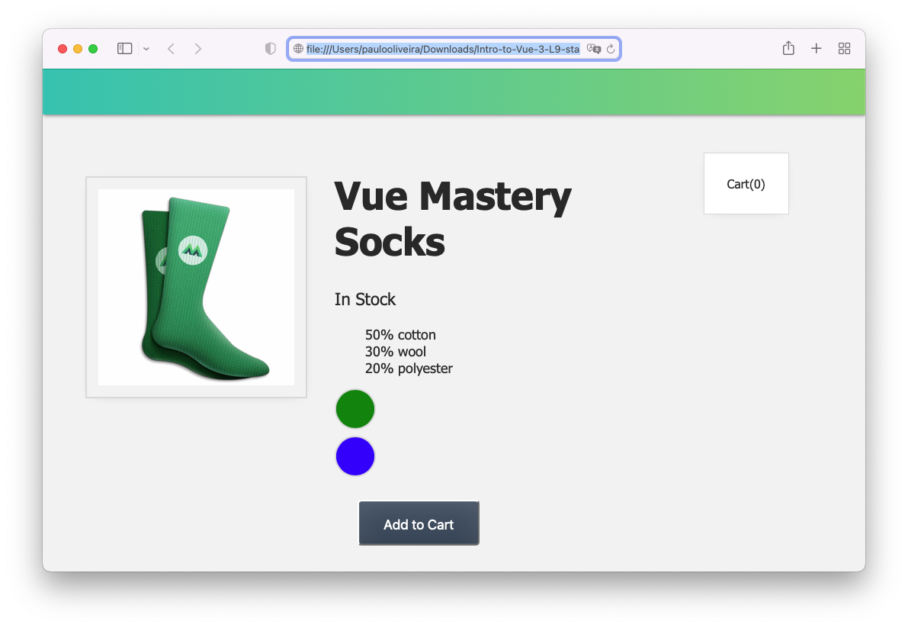
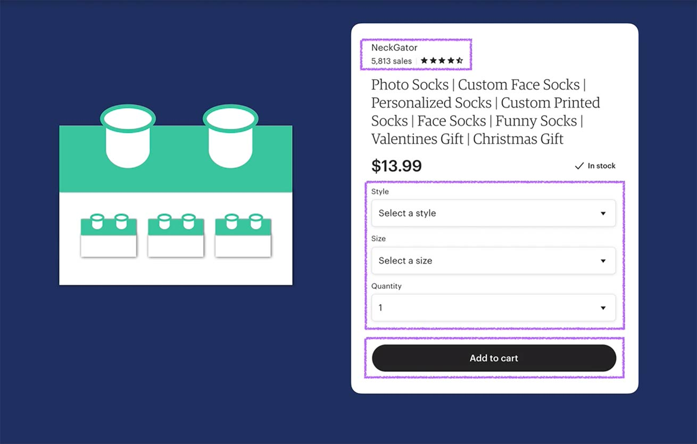
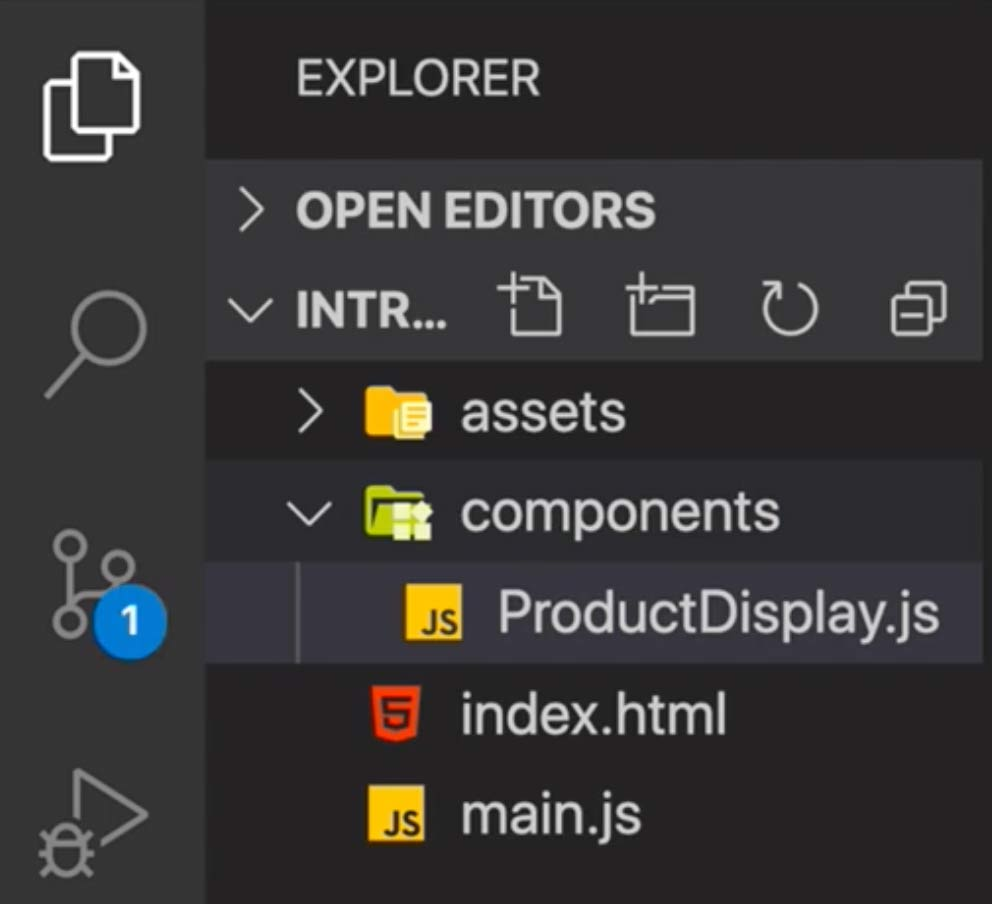
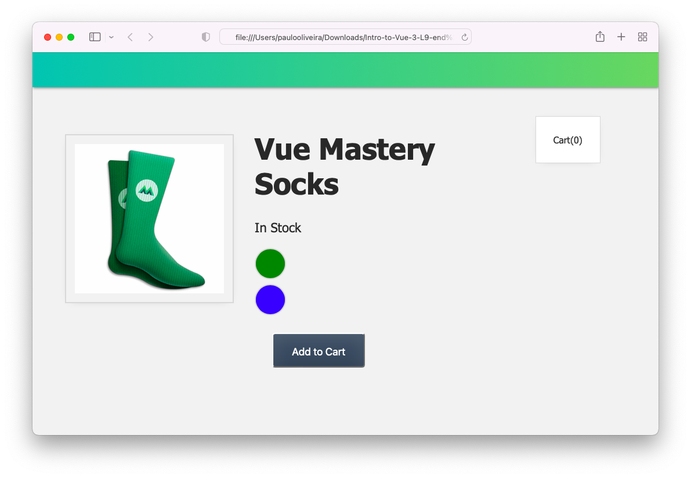
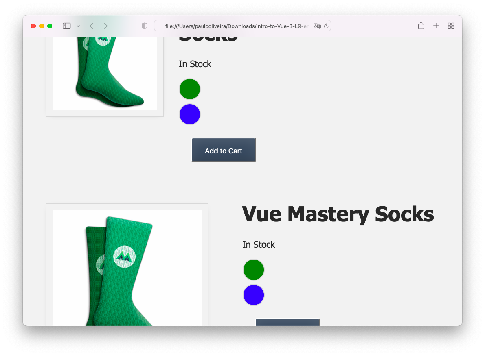

# **Introdução ao Vue.JS 3**

## **Este repositório possui um curso rápido de introdução ao Vue.JS 3**

Neste curso vamos aprender os fundamentos do Vue.JS e construir uma aplicação (_app_) para colocar estes conceitos em prática. Veja a figura abaixo.


## **IDE recomendado**

Vai-se utilizar o VSCode. Caso você ainda não o tenha [baixe-o](https://code.visualstudio.com/download), e depois instale-o.

Instale, também uma extensão do VSCode chamada [es6-string.html](https://marketplace.visualstudio.com/items?itemName=Tobermory.es6-string-html)

No final de cada tutorial, haverá um "***Coding Challenge***" para colocar os conceitos em prática.

## **Tutorial 9. Components & Props (Componentes e Propriedades)**

### **Passo 1. Configurando o ambiente de desenvolvimento**

1.1 Crie uma pasta chamada "intro-to-vue-3"

>Ignore o passo acima caso já tenha feito o **Tutorial 2** (Criando um Vue _app_ ).

1.2 Caso queira, para iniciar, faça o download do código inicial no "branch" do [repositório.](https://github.com/csp1po/intro_vue_3/tree/t9-start). Depois extraia este arquivo e copie o seu conteúdo para dentro da pasta criada no passo 1.1.

1.3 No painel esquerdo do VS Code, você verá uma estrutura de diretório que se parece com a figura abaixo.


Dentro do arquivo "**index.html**", o seu conteúdo será:

```html
<!DOCTYPE html>
<html lang="en">
  <head>
    <meta charset="UTF-8" />
    <title>Vue Mastery</title>
    <!-- Import Styles -->
    <link rel="stylesheet" href="./assets/styles.css" />
    <!-- Import Vue.js -->
    <script src="https://unpkg.com/vue@3/dist/vue.global.js"></script>
  </head>
  <body>
    <div id="app">
      <div class="nav-bar"></div>

      <div class="cart">Cart({{ cart }})</div>
      
      <div class="product-display">
        <div class="product-container">
          <div class="product-image">
            
          </div>
          <div class="product-info">
            <h1>{{ title }}</h1>

            <p v-if="inStock">In Stock</p>
            <p v-else>Out of Stock</p>
            <ul>
              <li v-for="detail in details">{{ detail }}</li>
            </ul>

            <div 
              v-for="(variant, index) in variants" 
              :key="variant.id" 
              @mouseover="updateVariant(index)" 
              class="color-circle" 
              :style="{ backgroundColor: variant.color }">
            </div>
            
            <button class="button" :class="{ disabledButton: !inStock }" :disabled="!inStock" v-on:click="addToCart">Add to Cart</button>
          </div>
        </div>
      </div>
    </div>

    <!-- Import App -->
    <script src="./main.js"></script>

    <!-- Mount App -->
    <script>
      const mountedApp = app.mount('#app')
    </script>
  </body>
</html>

```

> Observe que neste tutorial estaremos importando a biblioteca do Vue.JS via um link CDN (_Content Delivery Network_). Este tipo de importação se usa somente para fins de prototipagem e aprendizado. Futuramente usaremos a instalação via uma interface de linha de comando (Vue CLI).
>

>Observe também que estamos importando um arquivo chamado "**main.js**". O seu conteúdo, por enquanto, é:

```javascript
const app = Vue.createApp({
    data() {
        return {
            cart: 0,
            product: 'Socks',
            brand: 'Vue Mastery',
            selectedVariant: 0,
            details: ['50% cotton', '30% wool', '20% polyester'],
            variants: [
              { id: 2234, color: 'green', image: './assets/images/socks_green.jpg', quantity: 50 },
              { id: 2235, color: 'blue', image: './assets/images/socks_blue.jpg', quantity: 0 },
            ]
        }
    },
    methods: {
        addToCart() {
            this.cart += 1
        },
        updateVariant(index) {
            this.selectedVariant = index
        }
    },
    computed: {
        title() {
            return this.brand + ' ' + this.product
        },
        image() {
            return this.variants[this.selectedVariant].image
        },
        inStock() {
            return this.variants[this.selectedVariant].quantity
        },
    }
})
```

>Neste tutorial, veremos o conceito de componentes e propriedades (forma abreviada é ``props``) do Vue.js.(_Components & Props_).
>
>>Ao abrir o arquivo "**index.html**" no browser, você verá a figura abaixo.



>Neste Tutorial vamos refatorar o aplicativo de exemplo para usar um componente de produto, que usa uma ``prop``. E é o que faremos no próximo passo.

##### Antes, porém, convém fazer uma breve explanação sobre "Blocos de Construção" de uma _app_ Vue.

Nos frameworks front-end modernos que usam JavaScript, os componentes são os blocos de construção de um aplicativo, e esse certamente é o caso do Vue. Você pode imaginá-los como se fossem bloquinhos de Legos que você pode conectar uns aos outros em uma hierarquia de árvore genealógica de componentes. Ver figura abaixo.


Qualquer página da Web pode ser composta por vários componentes e é comum que esses componentes sejam “**pais**” que tenham componentes **filhos** aninhados dentro deles. Ver figura abaixo.




### **Passo 2. Criando Nosso Primeiro Componente**

2.1 Como nosso aplicativo eventualmente terá vários componentes, vamos criar uma pasta chamada ``components``, dentro da pasta chamada "**intro-to-vue-3**". Veja figura abaixo.



Após isto, vamos criar nosso primeiro componente, chamado ``ProductDisplay.js``, dentro da pasta ``components``.

2.2 Abra o arquivo ``components/ProductDisplay.js`` e coloque o trecho de código abaixo.

```javascript
app.component('product-display', {})
```
O primeiro argumento que se está passando é o nome do componente, ``product-display``, e o segundo argumento é um objeto para configurar este componente. Observe que esta ação é semelhante ao objeto de opções usado para configurar nosso Vue _app_ raiz.


2.3 Como precisamos que nosso componente tenha estrutura, adicionaremos a propriedade do modelo e colaremos todo o código HTML baseado no produto que reside atualmente no arquivo "**index.html**" aqui, dentro de um template. Para isto, abra o arquivo ``components/ProductDisplay.js`` criado no **Passo 2.2**, e substitua seu conteúdo pelo trecho de código abaixo:

```javascript
app.component('product-display', {
  template: 
    /*html*/ 
    `<div class="product-display">
      <div class="product-container">
        <div class="product-image">
          
        </div>
        <div class="product-info">
          <h1>{{ title }}</h1>
  
          <p v-if="inStock">In Stock</p>
          <p v-else>Out of Stock</p>
  
          <div 
            v-for="(variant, index) in variants" 
            :key="variant.id" 
            @mouseover="updateVariant(index)" 
            class="color-circle" 
            :style="{ backgroundColor: variant.color }">
          </div>
          
          <button 
            class="button" 
            :class="{ disabledButton: !inStock }" 
            :disabled="!inStock" 
            v-on:click="addToCart">
            Add to Cart
          </button>
        </div>
      </div>
    </div>`
})
```


Observe que não alteramos nada desse código, estamos simplesmente movendo-o para o componente de exibição do produto para que seja encapsulado lá. Se você está se perguntando o que ``/*html*/`` está fazendo na terceira linha, a resposta é que isso ativa a extensão "**es6-string-html**" do VS Code, que nos dá realce de sintaxe mesmo que estejamos neste template literal.


### **Passo 3. Dados e Métodos**

Agora que demos a este componente seu template, ou sua estrutura, precisamos fornecer seus dados e métodos, que ainda estão no arquivo "**main.js**". Então, é o que faremos agora: 

3.1 Abra o arquivo ``components/ProductDisplay.js`` e insira o conteúdo abaixo (copiado do arquivo "main.js") logo abaixo do template literal feito no passo anterior (**Passo 2.3**).

```javascript
template: 
    /*html*/ 
    `<div class="product-display">
      ...
    </div>`,
    
  data() {
    return {
        product: 'Socks',
        brand: 'Vue Mastery',
        selectedVariant: 0,
        details: ['50% cotton', '30% wool', '20% polyester'],
        variants: [
          { id: 2234, color: 'green', image: './assets/images/socks_green.jpg', quantity: 50 },
          { id: 2235, color: 'blue', image: './assets/images/socks_blue.jpg', quantity: 0 },
        ]
    }
  },
  methods: {
      addToCart() {
          this.cart += 1
      },
      updateVariant(index) {
          this.selectedVariant = index
      }
  },
  computed: {
      title() {
          return this.brand + ' ' + this.product
      },
      image() {
          return this.variants[this.selectedVariant].image
      },
      inStock() {
          return this.variants[this.selectedVariant].quantity
      }
  }
})
```
> Observe que excluímos a linha `cart : 0,` e a mantivemos no arquivo "**main.js**". Isto porque não precisamos que cada produto tenha seu próprio carrinho.
> 


### **Passo 4. Limpando o Arquivo "main.js"**

Agora que encapsulamos todo o código específico do produto em nosso componente de exibição do produto (_product-display_), podemos limpar nosso arquivo "**main.js**".

4.1 Abra o arquivo "**main.js**", e altere seu conteúdo para:

```javascript
const app = Vue.createApp({
    data() {
        return {
            cart: 0,
        }
    },
    methods: {}
})
```

>Deixamos o carrinho (i.e. ``cart``) e a opção ``methods`` porque ela terá um novo método mais adiante.

### **Passo 5. Importando o Componente**

5.1 Para usar a exibição do produto (``product-display``), precisamos importá-lo para o aqruivo "**index.html**". Para isto, abra-o e insira o trecho de código abaixo logo após a linha de importação da _app_.

```html
 <!-- Import Components -->
    <script src="./components/ProductDisplay.js"></script>
```

5.2 Agora que o componente foi importado, podemos usá-lo em nosso template. O trecho de código no arquivo "**index.html**" ficará assim:

```html
<div id="app">
  <div class="nav-bar"></div>

  <div class="cart">Cart({{ cart }})</div>
  <product-display></product-display>
</div>
```

> Se verificarmos isso no browser, veremos que tudo continua aparecendo como antes, porém agora, como reorganizamos as coisas, o botão ``Add to Cart`` não está mais incrementando o carrinho. Vamos corrigir isso posteriormente.

5.3 Abra o arquivo "**index.html**" no seu navegador. Você verá a figura abaixo.



5.4 A título de observação, para mostrar como esses blocos de código reutilizáveis podem ser úteis, vamos inserir mais dois componentes de exibição do produto (``product-display``). Abra o arquivo "**index.html**" novamente e modifique seu conteúdo para:

```html
<div id="app">
  <div class="nav-bar"></div>

  <div class="cart">Cart({{ cart }})</div>
  <product-display></product-display>
  <product-display></product-display>
  <product-display></product-display>
</div>
```

> Quando atualizamos o navegador, veremos todos eles aparecendo. Cada um deles é funcional de forma independente. Veja a figura abaixo.



### **Passo 6. Props**

Agora que estamos começando a aprender como encapsular código reutilizável nesses componentes, o que acontece quando nosso componente precisa de algo que está fora dele mesmo? Por exemplo, e se o componente pai, por assim dizer, tivesse alguns dados de mensagem e o componente filho precisasse deles? Como um componente tem seu próprio escopo isolado, ele não pode alcançar algo que esteja fora deste alcançe. A figura abaixo ilustra o que acabamos de dizer.


E como resolver isto? A resposta aqui é o uso das ``props``. Elas são atributos personalizados para passar dados para um componente. Elas funcionam como um funil, no qual você pode passar dados que o componente precisa. Veja a figura abaixo.


> Vamos adicionar a capacidade de nosso componente ``product-display`` receber uma ``prop``.

### **Passo 7. Fornecendo uma ``prop`` ao nosso componente**

Vamos dar ao nosso _aap_ Vue raiz, localizado em "**main.js**", uma nova propriedade de dados, que indica se o usuário é ``premium`` ou não.

7.1 Abra o arquivo "**main.js**" altere o seu conteúdo para:

```javascript
const app = Vue.createApp({
   data() {
      return {
         cart: 0,
         premium: true
      }
   },
   methods: {}
})
```
O que fizemos acima foi para indicar se caso um usuário for ``premium``, o frete (``shipping``) será gratuito. Portanto, nosso componente ``product-display`` precisa acessar esses dados. Em outras palavras, ele precisa de um atributo personalizado (um funil) no qual possamos alimentá-los. Vamos adicionar isso agora, dando ao componente uma ``prop`` ``premium`` a ele. A figura abaixo ilustra o que iremos fazer e como isto acontece.


7.2 Abra o aqruivo "**components/ProductDisplay.js**" e adicione o trecho de código abaixo logo abaixo da **primeira linha**:

```javascript
app.component('product-display', {
 props: {
    premium: {
      type: Boolean,
      required: true
    }
  },
  ...
```

> **Observação #1**: a primeira linha está repetida no trecho acima.

> **Observação #2**: como o recurso ``props`` do Vue possui um tipo de validação interna (embutida), podemos especificar coisas como o seu tipo e se ela é necessária.

7.3 Agora que configuramos isso, podemos adicionar esse atributo personalizado ao nosso ``product-display``. Abra o arquivo "**index.html**" e observe o trecho de código abaixo.

```html
<div id="app">
   <div class="nav-bar"></div>

   <div class="cart">Cart({{ cart }})</div>
   <product-display></product-display>
   <product-display></product-display>
   <product-display></product-display>
</div>
```

Agora altere-o para:

```html
<div id="app">
   <div class="nav-bar"></div>

   <div class="cart">Cart({{ cart }})</div>
   <product-display :premium="premium"></product-display>
</div>
```

> Observe como estamos usando a abreviação da diretiva ``v-bind`` para que possamos receber de forma reativa o novo valor ``premium`` caso ele seja atualizado (de ``true`` para ``false``).

### **Passo 8. Usando a Prop**

Agora que nosso componente ``product-display`` possui uma ``prop`` _premium_, podemos usá-la dentro dele. Lembre-se, queremos utilizar o fato de um usuário ser _premium_ ou não para determinar o que ele precisa pagar pelo frete (_shipping_).

8.1 Abra o arquivo "**components/ProductDisplay.js**" e insira o elemento ``<p>`` que indica o ``shipping`` nele. Ele deve ficar logo abaixo da diretiva ``v-else``. Segue o trecho de código.

```javascript
template: 
  /*html*/
  `<div class="product-display">
    ...
      <p v-if="inStock">In Stock</p>
      <p v-else>Out of Stock</p>
      
      <p>Shipping: {{ shipping }}</p>
    ...
  </div>`,
```

8.2 Ainda dentro de arquivo "**components/ProductDisplay.js**", vamos, inserir uma nova propriedade computada no componente ``product-display``:

```javascript
computed: {
  ...
  shipping() {
    if (this.premium) {
      return 'Free'
    }
      return 2.99
  }
}
```

> Esta propriedade computada verifica se a ``prop`` _premium_ é verdadeira. Se for, retorna 'Free', caso contrário, retorna 2.99 de frete (_shipping_).

8.3 Para verificar o que fizemos, abra o arquivo "index.html" no browser. Você verá a figura abaixo.


> Se alterarmos o valor da propriedade de dados ``premium`` no arquivo "**main.js**" para ``false``, o browser irá mostrar:


### **Passo 9. Coding Challenge**

9.1 Crie um novo componente chamado ``product-details``, que recebe os detalhes através de uma ``prop`` chamada ``details``. Esta ``prop``deve ser do tipo _array_.

9.2 Abra o arquivo "**index.html**" no browser. Você verá algo assim.


