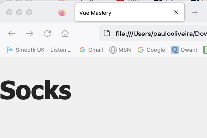
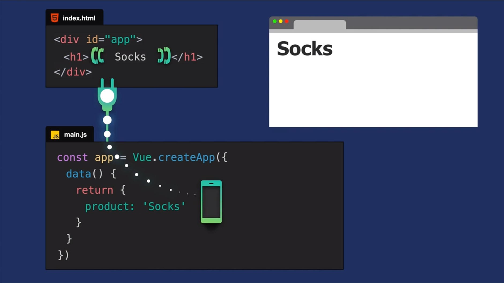

# **1. Tutorial Introdução ao Vue.JS 3**

## **Este repositório possui um curso rápido de introdução ao Vue.JS 3**

Neste curso vamos aprender os fundamentos do Vue.JS e construir uma aplicação (_app_) para colocar estes conceitos em prática. Veja a figura abaixo.


## **IDE recomendado**

Vai-se utilizar o VSCode. Caso você ainda não o tenha [baixe-o](https://code.visualstudio.com/download), e depois instale-o.

Instale, também uma extensão do VSCode chamada [es6-string.html](https://marketplace.visualstudio.com/items?itemName=Tobermory.es6-string-html)

No final de cada tutorial, haverá um "Coding Challenge" para colocar os conceitos em prática.

## **2. Criando uma Vue App**

### **Passo 1. Configurando o ambiente de desenvolvimento**

1.1 Crie uma pasta chamada "intro-to-vue-3"

1.2 Para iniciar, faça o download do código inicial no "branch" do [repositório.](https://github.com/csp1po/intro_vue_3/tree/t2-start). Depois extraia este arquivo e copie o seu conteúdo para dentro da pasta criada no passo 1.1.

1.3 No painel esquerdo do VS Code, você verá uma estrutura de diretório que se parece com a figura abaixo.


Dentro do arquivo "**index.html**", o seu conteúdo será:

```html
<!DOCTYPE html>
<html lang="en">
  <head>
    <meta charset="UTF-8" />
    <title>Vue Mastery</title>
    <!-- Import Styles -->
    <link rel="stylesheet" href="./assets/styles.css" />
    <!-- Import Vue.js -->
    <script src="https://unpkg.com/vue@3/dist/vue.global.js"></script>
  </head>
  <body>
    <div id="app">
      <h1>Product goes here</h1>
    </div>

    <!-- Import Js -->
    <script src="./main.js"></script>
  </body>
</html>
```

> Observe que neste tutorial estaremos importando a biblioteca do Vue.JS via um link CDN (_content delivery network_). Este tipo de importação se usa somente para fins de prototipagem e aprendizado. Futuramente usaremos a instalação via uma interface de linha de comando (Vue CLI).
>
>Observe também que estamos importando um arquivo chamado "**main.js**". O seu conteúdo, por enquanto, é muito simples:

```javascript
const product = 'Socks'
```

>Outra coisa interessante também, é que no código HTML acima, temos um elemento ``<h1>`` que diz: "**_Product goes here_**". A grande questão agora é: **como vamos mostrar o produto usando o Vue?**.

### **Passo 2. Criando e montando nossa app**

2.1 Abra o arquivo "**main.js**" e substitua o seu conteúdo por este:

```javascript
const app = Vue.createApp({
    data() {
        return {
            product: 'Socks'
        }
    }
})
```

2.2 Precisamos agora montar nossa app. Para isto, abra o arquivo "**index.html**" e antes do ``</body>`` adicione o seguinte código:

```html
<!-- Mount App -->
<script>
    const mountedApp = app.mount('#app')
</script>
```

>Falamos "_app_", que se refere ao aplicativo que acabamos de criar, e ``.mount()``, que é um método o qual requer um seletor DOM como argumento. Isso nos permite conectar o aplicativo Vue a essa parte do nosso DOM.

2.3 Agora que criamos, importamos e montamos nossa _app_ Vue, podemos começar a mostrar os dados que estão dentro dela. Para renderizar o produto (``product``) dentro do elemento ``<h1>``. Abra o arquivo "**index.html**" e no trecho de código que temos: 

```html
<div id="app">
    <h1>Product goes here</h1>
</div>
```

, substitua por este:

```html
<div id="app">
    <h1>{{ product }}</h1>    
</div>
```

>Agora, se abrirmos o arquivo "**index.html**" no browser (navegador), veremos o produto sendo mostrado. Ver figura abaixo:



### **Passo 3. Compreendendo a Instância Vue**

3.1 Quando criamos nosso _app_ Vue, passamos um objeto de opções, o que nos permitiu adicionar algumas propriedades opcionais para configurar o aplicativo. Fazer isso cria nossa instância Vue, que é o coração de nosso aplicativo Vue, que alimenta tudo.

### main.js

```javascript
const app = Vue.createApp({Options Object})
```

3.2 Ao importar esse _app_ e montá-lo no DOM, basicamente nós o conectamos a ele (DOM), dando ao nosso HTML uma linha direta com o aplicativo. Dessa forma, nosso template de código pode acessar opções desse _app_, como, por exemplo, seus dados.



3.3 Se você está se perguntando o que está acontecendo com essa sintaxe de chaves duplas, você pode imaginá-la como um telefone, que tem acesso ao nosso aplicativo Vue. A partir do nosso template, podemos perguntar ao aplicativo: “Ei, qual é o valor do produto?”. E o _app_ responde: “**Socks**”. Quando a página renderiza, vemos a exibição de “**Socks**” na página.

>Se essa sintaxe de chaves duplas, ou sintaxe de bigode, como é chamada, for novidade para você, ela nos permite escrever expressões JavaScript. Em outras palavras, ela nos permite executar um código JavaScript válido em nosso HTML.

### **Passo 4. Reatividade do Vue**

4.1 O que aconteceria se alterássemos o valor de ``product`` de "**Socks**" para "**Boots**"?

### main.js

```javascript
const app = Vue.createApp({
    data() {
        return {
            product: 'Boots'  //valor atualizado
        }
    }
})
```

4.2 Devido a maneira como o Vue funciona, a expressão do elemento ``<h1>`` que depende do produto receberia automaticamente esse novo valor e nosso DOM seria atualizado para exibir “**Boots**”.

### index.html

```javascript
<div id="app">
  <h1>{{ product }}</h1> <! -- receberá de forma reativa todas as atualizações de "product" -->
</div>
```

4.3 Isso ocorre porque o Vue é reativo. Internamente, ele tem todo um sistema de reatividade que lida com atualizações. Quando  os valores dos dados mudam, qualquer lugar que dependa desses dados será atualizado automaticamente para nós. Não precisamos fazer nada para que isso aconteça.

### **Passo 5. Coding Challenge**

5.1 Adicione uma ``description`` ao objeto de dados

5.2 Mostre a ``description``usando uma expressão dentro de um elemento ``<p>``.


