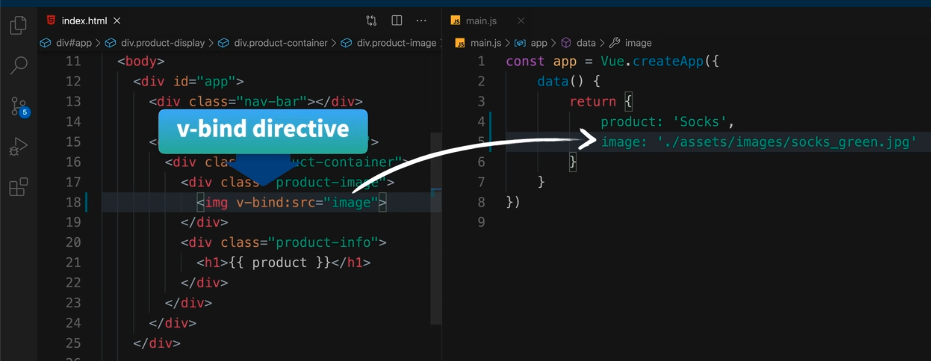
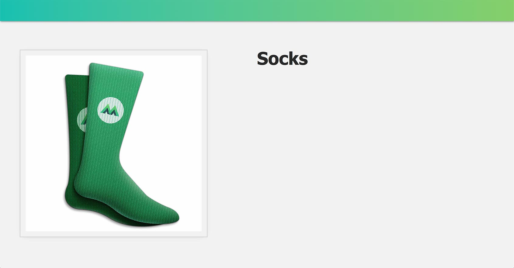
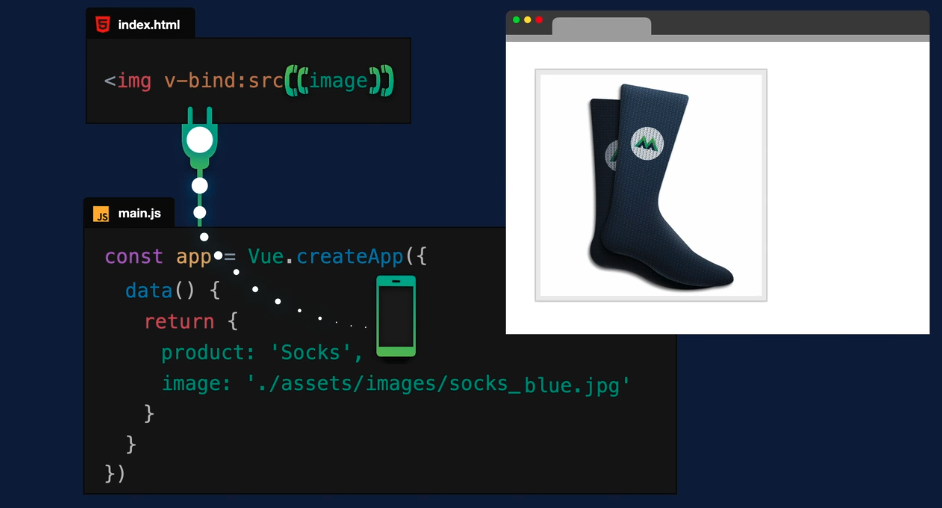
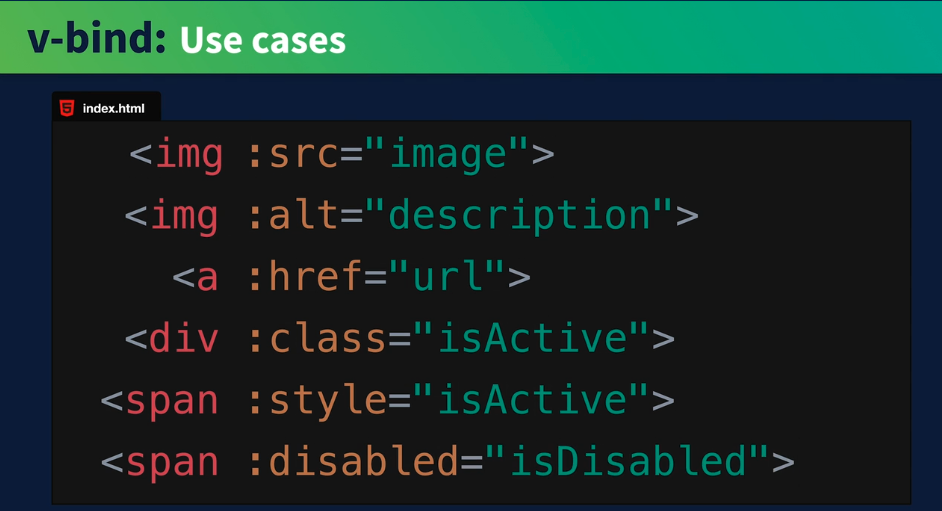

# **1. Tutorial Introdução ao Vue.JS 3**

## **Este repositório possui um curso rápido de introdução ao Vue.JS 3**

Neste curso vamos aprender os fundamentos do Vue.JS e construir uma aplicação (_app_) para colocar estes conceitos em prática. Veja a figura abaixo.


## **IDE recomendado**

Vai-se utilizar o VSCode. Caso você ainda não o tenha [baixe-o](https://code.visualstudio.com/download), e depois instale-o.

Instale, também uma extensão do VSCode chamada [es6-string.html](https://marketplace.visualstudio.com/items?itemName=Tobermory.es6-string-html)

No final de cada tutorial, haverá um "Coding Challenge" para colocar os conceitos em prática.

## **3. Vinculação (Ligação) de Atributos (Attribute Binding)**

### **Passo 1. Configurando o ambiente de desenvolvimento**

1.1 Crie uma pasta chamada "intro-to-vue-3"

>Ignore o passo acima caso já tenha feito o tutorial anterior (Criando um Vue _app_ ).

1.2 Caso queira, para iniciar, faça o download do código inicial no "branch" do [repositório.](https://github.com/csp1po/intro_vue_3/tree/t3-start). Depois extraia este arquivo e copie o seu conteúdo para dentro da pasta criada no passo 1.1.

1.3 No painel esquerdo do VS Code, você verá uma estrutura de diretório que se parece com a figura abaixo.


Dentro do arquivo "**index.html**", o seu conteúdo será:

```html
<!DOCTYPE html>
<html lang="en">
  <head>
    <meta charset="UTF-8" />
    <title>Vue Mastery</title>
    <!-- Import Styles -->
    <link rel="stylesheet" href="./assets/styles.css" />
    <!-- Import Vue.js -->
    <script src="https://unpkg.com/vue@3/dist/vue.global.js"></script>
  </head>
  <body>
    <div id="app">
      <div class="nav-bar"></div>
      
      <div class="product-display">
        <div class="product-container">
          <div class="product-image">
            <!-- image goes here -->
          </div>
          <div class="product-info">
            <h1>{{ product }}</h1>
          </div>
        </div>
      </div>
    </div>

    <!-- Import App -->
    <script src="./main.js"></script>

    <!-- Mount App -->
    <script>
      const mountedApp = app.mount('#app')
    </script>
  </body>
</html>

```

> Observe que neste tutorial estaremos importando a biblioteca do Vue.JS via um link CDN (_content delivery network_). Este tipo de importação se usa somente para fins de prototipagem e aprendizado. Futuramente usaremos a instalação via uma interface de linha de comando (Vue CLI).
>
>Observe também que estamos importando um arquivo chamado "**main.js**". O seu conteúdo, por enquanto, é muito simples:

```javascript
const app = Vue.createApp({
    data() {
        return {
            product: 'Socks'
        }
    }
})
```

### index.html

No código HTML acima, temos uma nova ``<div>``com uma classe chamada ``product-image``:

```html
<div class="product-image">
  <!-- image goes here -->
</div>
```

>No final deste tutorial, teremos um elemento ```` aqui que é vinculado de forma reativa a uma nova propriedade chamada ``image`` em nossos dados. Sempre que o valor dessa imagem mudar, ela será atualizada no DOM.


### **Passo 2. Adicionando uma imagem em nossos dados**

>Você lembra que no diretório ``assets`` temos uma pasta chamada ``images``, com imagens para meias verdes e azuis? Vamos direcionar uma dessas imagens para uma nova propriedade de dados em nosso aplicativo Vue. Faremos isso definindo ``image`` igual a um caminho para que ele possa capturar essa imagem.

2.1 Abra o arquivo "**main.js**" e substitua o seu conteúdo por este:

```javascript
const app = Vue.createApp({
    data() {
        return {
            product: 'Socks',
            image: './assets/images/socks_green.jpg'
        }
    }
})
```

2.2 Agora estamos prontos para adicionar um elemento ````no nosso template. Para isto, abra o arquivo "**index.html**". Procure o trecho de código abaixo:

```html
<div class="product-image">
    <!-- image goes here -->
</div>```

Agora você deve substituir o conteúdo por este:

```html
<div class="product-image">
  
</div>
```
>No atributo "source", diremos ``image`` somente. Por enquanto, isso não vai fazer nada. Queremos que ``src`` extraia o caminho da imagem de nossos dados, semelhante a como extraímos o valor dos dados do ``product`` na expressão ``<h1>`` do tutorial anterior.


>Portanto, a questão aqui é: como vinculamos (i.e. bind) o atributo ``src`` aos dados de ``image``? É o que faremos no próximo passo.


### **Passo 3. Apresentando a Vinculação de Atributo (Attribute Binding)**

3.1 Para criar um vínculo entre um atributo de um elemento HTML e um valor dos dados do _app_ Vue, usaremos uma diretiva do Vue.JS chamada ``v-bind``. Para isto, abra o arquivo "**index.html**", e altere o conteúdo do elemento ```` do passo 2.2 como indicado abaixo:

### index.html

```javascript

```
>Agora, criamos um _vínculo reativo_ entre o atributo ``src="image"``e os próprios dados da imagem. Ver figura abaixo.



3.2 Aogra abra o arquivo "**index.html**" no browser. Você verá a página abaixo.




### **Passo 4. Compreendendo o v-bind**

4.1 Como exatamente a diretiva ``v-bind`` está funcionando? Nós a usamos para vincular dinamicamente um atributo a uma expressão. Nesse caso, o atributo é ``src`` e a expressão é o que estiver entre as aspas desse atributo: ``"image"``. Para mostrar melhor, observe abaixo:

### index.html

```javascript
 <! -- src attribute bound to the image data -->
```

>Se você está pensando que isso não se parece com uma típica expressão JavaScript, você pode imaginá-la assim: ``v-bind:src="{{ image }}"``. Implicitamente, o Vue vai avaliá-lo da mesma forma. Veja a figura abaixo.


4.2 Por causa do sistema de reatividade do Vue, se atualizarmos nossos dados da imagem para um caminho que aponte para a imagem das meias azuis (``image: './assets/images/socks_blue.jpg'``), a expressão à qual nosso atributo ``src`` está vinculado seria atualizado e nosso navegador exibiria a imagem das meias azuis. A figura abaixo mostra como esta vinculação é reativa e dinâmica.




4.3 O uso da diretiva ``v-bind`` é tão comum que existe uma abreviação (_shorthand_) para isso, que é usar apenas os dois pontos:

```html
 
```

>Assim como existem tantos atributos HTML diferentes, existem muitos casos de uso para o ``v-bind``. Por exemplo, você pode vincular uma descrição a um atributo ``alt``, vincular uma URL a um ``href``, vincular alguns estilos dinâmicos a uma classe (``class``) ou atributo de estilo (``style``), desativar e ativar um botão e assim por diante. Ver figura abaixo.




### **Passo 5. Coding Challenge**

5.1 Adicione um ``url`` ao objeto de dados

5.2 Use ``v-bind``para vincular este URL para um atributo ``href``do elemento ``<a>``.

5.3 Abra o arquivo "**index.html**" no browser. Você verá algo assim.


